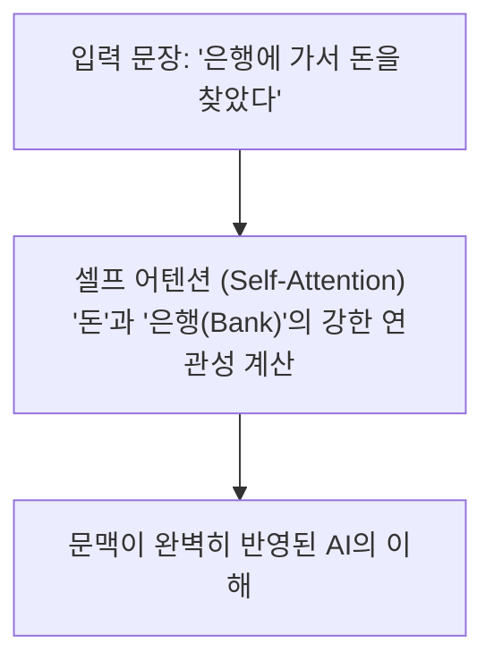

# 📚 0-3. 나만의 AI 학습 위키(Wiki) 확장 가이드

> **"교재를 읽다가 어려운 개념이 나오면, AI에게 나만을 위한 백과사전 문서를 쓰게 하세요!"**  
> 본 가이드는 수강생이 교재 본문의 핵심 흐름을 해치지 않으면서, 스스로 AI를 활용해 **나만의 심화 위키(Personal Wiki)**를 구축하고 유기적으로 연결하는 방법을 안내합니다.

---

## 🎯 왜 '나만의 위키'를 만들어야 할까요?

1. **내 눈높이에 맞춘 1:1 맞춤형 과외 (Personalized Tutoring)**
   - 공용 교재는 모두를 위한 최소한의 분량으로 쓰여 있습니다. 내가 모르는 특정 단어(예: 트랜스포머, 토큰, 임베딩, CORS 등)만 골라 AI에게 가장 쉬운 비유로 해설을 요구할 수 있습니다.
2. **본문의 깔끔함 유지 (Progressive Disclosure)**
   - 본문 교재에 모든 지식을 다 적으면 책이 수천 페이지로 늘어나 흐름을 잃게 됩니다. 핵심 줄기(본문)와 깊이 있는 세부 가지(`wiki/`)를 분리하면 훨씬 읽기 편해집니다.
3. **양방향 링크(Hyperlink)로 연결된 살아있는 지식**
   - 클릭 한 번으로 보충 설명을 보고, 다시 원래 읽던 위치로 돌아오는 현대적인 지식 베이스 구축 경험을 체득합니다.

---

## 📂 1. 권장 디렉토리 및 링크 구조

내가 공부하는 챕터 폴더 하위에 **`wiki/`** 서브폴더를 만들고, 본문과 위키 문서 간에 **양방향 하이퍼링크**를 걸어줍니다.

```text
1.교육자료/기본_AI 이해/
├── 2. AI의_이해.md              # 📖 본문 교재 (핵심 흐름 유지)
└── 📁 wiki/                     # 📚 [신설] 나만의 개인화 지식 확장소
    ├── 트랜스포머_원리와_어텐션.md
    ├── 토큰화와_임베딩.md
    └── RAG_작동_메커니즘.md
```

#### 🔗 양방향 링크 연결 규칙
- **본문 교재 (`2. AI의_이해.md`)**:
  > ... 딥러닝 설계도 중 하나인 **트랜스포머(Transformer)** 구조입니다.  
  > 💡 **[📖 나만의 심화 위키: 트랜스포머의 원리와 셀프 어텐션](wiki/트랜스포머_원리와_어텐션.md)**
- **위키 문서 (`wiki/트랜스포머_원리와_어텐션.md`) 상단**:
  > 🔙 **[돌아가기: 2. AI의_이해.md (1.2 트랜스포머)](../2.%20AI의_이해.md#12-ai의-계보--인공지능--머신러닝--딥러닝--트랜스포머)**

---

## 💬 2. AI에게 그대로 던지는 "마법의 프롬프트 템플릿"

교재를 읽다가 이해하기 어려운 부분을 발견하면, 아래 프롬프트를 복사하여 AI 대화창에 입력하세요:

```markdown
[복사해서 쓸 프롬프트]

내가 지금 `1.교육자료/기본_AI 이해/2. AI의_이해.md` 문서의 [1.2 트랜스포머] 부분을 읽고 있는데, 
이 개념이 비전공자인 나에게는 조금 어렵게 느껴져.

아래 지침에 맞춰서 나를 위한 맞춤형 보충 해설 문서를 작성하고 연결해줘:

1. **문서 생성 위치**: `1.교육자료/기본_AI 이해/wiki/트랜스포머_원리와_어텐션.md`
2. **설명 구성 (파인만 기법)**:
   - 1단계: 초등학생도 단번에 이해할 수 있는 쉬운 일상 비유 (예: 도서관 사서, 요리사 등)
   - 2단계: Mermaid.js 다이어그램을 활용한 시각적 원리 흐름도
   - 3단계: 기술적 핵심 — "왜 기존 기술보다 혁신적인가?" (Why)
   - 4단계: 실무/바이브 코딩 시 알아두면 좋은 팁
3. **양방향 링크 연결**:
   - 새로 만드는 위키 문서 맨 위에 `[🔙 2. AI의_이해로 돌아가기]` 링크를 달아줘.
   - 내가 읽던 원본 문서(`2. AI의_이해.md`)의 해당 단락 바로 아래에도 `[📖 심화 위키: 트랜스포머]` 링크를 삽입해줘.
```

---

## 📄 3. AI가 생성해 주는 표준 위키 문서 예시

AI가 위 프롬프트를 받아 작성하게 될 표준 위키 문서의 형태입니다:

````markdown
# 📚 [Wiki] 트랜스포머(Transformer)와 셀프 어텐션(Self-Attention)

> 🔙 **[2. AI의_이해.md로 돌아가기](../2.%20AI의_이해.md#12-ai의-계보--인공지능--머신러닝--딥러닝--트랜스포머)**  
> 🏷️ **핵심 키워드**: `딥러닝`, `Attention Is All You Need`, `병렬 연산`, `문맥 파악`

---

## 1. ☕ 1분 비유로 이해하기
- **기존 방식 (RNN)**: 한 글자씩 소리 내어 읽는 사람 (앞 글자를 다 읽어야 뒷 글자를 읽음 ➔ 느리고, 앞 내용을 까먹음)
- **트랜스포머 (Transformer)**: 한눈에 문장 전체를 훑어보는 속독가 (단어들 간의 관계를 한 번에 계산 ➔ 빠르고 긴 맥락 기억)

---

## 2. 🏗️ 핵심 원리 시각화 (Mermaid)


---

## 3. 💡 왜 혁신이었는가? (Why?)
1. **병렬 연산(GPU 가속)**: 단어를 순서대로 기다리지 않고 한 번에 계산하므로 초대형 데이터 학습이 가능해졌습니다.
2. **장기 의존성(Long-term Memory) 해결**: 문장이 아무리 길어져도 단어와 단어 사이의 관계를 직접 연결합니다.

---

## 🎯 실무/바이브 코딩 시 기억할 점
- 우리가 쓰는 **ChatGPT, Claude, Gemini의 핵심 엔진이 바로 이 Transformer**입니다.
- AI가 이전 대화(Context)를 기억하고 답변하는 모든 과정은 트랜스포머의 어텐션 메커니즘을 기반으로 동작합니다.
````

---

## 🚀 실전 꿀팁 (Best Practice)

1. **절대 한 문서에 모든 걸 담으려 하지 마세요.**  
   - 모르는 개념마다 `wiki/` 폴더에 1개씩 짧고 굵은 문서를 만들면, 학습이 끝났을 때 나만의 훌륭한 **'사내 AI 백과사전'**이 완성됩니다.
2. **링크가 제대로 작동하는지 확인하세요.**  
   - 마크다운 파일 링크는 `[문서명](상대경로.md)` 형태로 작성하면 VS Code / Antigravity IDE / GitHub 어디서든 클릭으로 즉시 이동할 수 있습니다.
