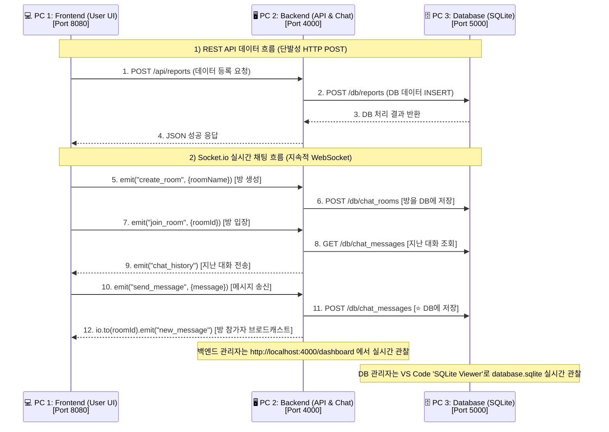

# 📘 3-Tier 아키텍처 API 실습 & 바이브 코딩 협업 매뉴얼

본 매뉴얼은 3명의 교육 참석자가 각각 **[Frontend / Backend / Database]** 3개 계층(Tier)을 나누어 가동하고,
**REST API 및 Socket.io 실시간 채팅**을 연동한 뒤,
**바이브 코딩으로 AI 요약 기능까지 직접 확장(1차 ➡️ 2차)** 해 보는 **실무형 협업 지침서**입니다.

```
┌──────────────────────────────────────────────────────────────────┐
│                                                                  │
│   1차 (v1_basic)     이미 완성된 채팅앱을 "실행하고 관찰"한다      │
│        ↓                 → 3계층이 어떻게 연결되는지 눈으로 확인   │
│                                                                  │
│   2차 (v2_extended)  AI에게 계획서를 주고 "직접 확장"한다          │
│                          → /요약 기능을 3계층에 걸쳐 만들어 본다   │
│                                                                  │
└──────────────────────────────────────────────────────────────────┘
```

---

## 🏛 1. 3-Tier 시스템 전체 구조도 및 통신 프로토콜



> ### ⭐ v1_basic의 핵심 관찰 포인트
> **채팅 메시지는 화면에만 뜨는 게 아니라 반드시 DB를 거칩니다.**
> 11번 단계가 없으면 12번(브로드캐스트)도 일어나지 않습니다.
> 즉 **DB Tier(5000)를 끄면 채팅이 멈춥니다.** 직접 꺼 보십시오. 그게 3-Tier입니다.

---

## 🗄 2. 데이터베이스 구조 (v1_basic)

`database/database.sqlite` 는 **진짜 SQLite 파일**입니다.
Node.js 내장 모듈 `node:sqlite` 를 쓰므로 **별도 설치가 필요 없습니다.**

| 테이블 | 역할 | 언제 행이 늘어나는가 |
|---|---|---|
| `users` | 회원 | 회원가입 할 때 |
| `reports` | 업무 보고서 | 보고서 등록 폼 제출할 때 |
| `chat_rooms` | 대화방 | 방 만들기 할 때 |
| **`chat_messages`** | **채팅 기록** | **채팅 한 줄 칠 때마다** ⭐ |

```sql
chat_messages (
  id      INTEGER PRIMARY KEY AUTOINCREMENT,   -- 저장된 순서. ⭐ 이게 전부다
  room_id TEXT NOT NULL,
  sender  TEXT NOT NULL,
  message TEXT NOT NULL
)
```

> ### ⭐ 여기에 없는 것을 먼저 보십시오 — **시간 컬럼이 없습니다.**
> `users`·`reports`·`chat_rooms` 에는 `created_at` 이 있는데 **`chat_messages` 에만 없습니다.**
> v1은 채팅을 오직 **id(저장된 순서)** 로만 다룹니다.
> **"몇 시에 말했는가"는 어디에도 기록되지 않습니다.**

### 🔍 SQLite Viewer 로 실시간 관찰하기

```
① VS Code 확장앱 'SQLite Viewer' 설치
② database/database.sqlite 우클릭 → "Open with SQLite Viewer"
③ chat_messages 테이블 선택
④ 브라우저에서 채팅을 친다
⑤ SQLite Viewer 를 새로고침 → ⭐ 행이 늘어나는 것을 확인
```

### 💡 그래서 v1의 채팅 화면에는 시각이 안 나옵니다

```
┌─ v1_basic 채팅창 ────────────────────┐        ┌─ v2_extended 완성 후 ────────────────┐
│  홍길동                        #1    │        │  홍길동                       15:10  │
│  오늘 회의는 3시입니다                │        │  오늘 회의는 3시입니다                │
│                                      │        │                                      │
│  김철수                        #2    │  ───▶  │  김철수                       15:12  │
│  네 알겠습니다                        │        │  네 알겠습니다                        │
│                                      │        │                                      │
│  ↑ 저장 순서(id)만 표시               │        │  ↑ 실제 시각(timestamp) 표시          │
└──────────────────────────────────────┘        └──────────────────────────────────────┘
```

> ### 🔑 2차 실습의 핵심 질문
> **"시간대별로 요약하고 싶다. 그런데 DB에 시간이 없다. 어떻게 하지?"**
>
> ```
> v1  chat_messages(id, room_id, sender, message)
>       → ORDER BY id            "몇 번째로 저장됐는가"
>
> v2  chat_messages(id, room_id, sender, message, timestamp)   ← 컬럼을 추가한다
>       → ORDER BY timestamp     "몇 시에 말했는가"
>       → WHERE timestamp BETWEEN ...   시간 범위로 걸러낼 수 있게 된다
> ```
>
> **기능을 만들려다 보니 표(스키마) 자체를 고치게 되는 것** — 이게 2차 실습의 진짜 내용입니다.

---

## 🌐 3. 브라우저 주소창으로 API 확인하기 ⭐

별도 프로그램(Postman 등) 없이 **주소창에 그냥 치면 JSON이 나옵니다.**

| 주소 | 무엇을 보여주나 | 어느 계층 |
|---|---|:---:|
| `http://localhost:5000/health` | DB 서버 생존 확인 | DB |
| `http://localhost:5000/db/chat_messages?room_id=lobby` | 채팅 기록 (DB 직접) | DB |
| `http://localhost:5000/db/reports` | 보고서 목록 (DB 직접) | DB |
| `http://localhost:4000/api/chat/messages?room_id=lobby` | 채팅 기록 (**백엔드 경유**) | Backend |
| `http://localhost:4000/api/dashboard/stats` | 전체 통계 | Backend |
| `http://localhost:4000/dashboard` | 관리자 대시보드 화면 | Backend |

### 🎓 이 두 주소를 나란히 열어 비교해 보십시오

```
http://localhost:5000/db/chat_messages?room_id=lobby      ← DB가 직접 준 데이터
http://localhost:4000/api/chat/messages?room_id=lobby     ← 백엔드가 전달한 데이터

  → 내용이 같습니다.
  → 백엔드는 데이터를 "가지고 있는" 게 아니라
    DB에게 물어보고 그대로 넘겨줄 뿐이라는 뜻입니다.

  → ⭐ DB 서버(5000)를 끄고 4000번 주소를 다시 열어 보십시오.
     백엔드는 살아 있는데도 에러가 납니다. 그게 계층 구조입니다.
```

---

## 📊 4. 1차 기본 vs 2차 확장 비교

| 비교 항목 | **1차 기본** (`v1_basic`) | **2차 확장** (`v2_extended`) |
|---|---|---|
| **누가 만드나** | ✅ 이미 완성됨 (실행하고 관찰만) | 🤖 **AI가 만든다** (계획서를 주고 시킨다) |
| **🗄️ DB 테이블** | `users` `reports` `chat_rooms` `chat_messages` | **+ `settings`** (API 키 보관)<br>**+ `summaries`** (요약 결과 보관) |
| **`chat_messages` 스키마** | `id` `room_id` `sender` `message`<br>**시간 컬럼 없음** | **+ `timestamp`** ⭐ (4단계에서 추가) |
| **채팅 조회 기준** | `ORDER BY id` (저장 순서) | **`ORDER BY timestamp`** (실제 시각)<br>**+ 시간 범위 필터** (`from`/`to`) |
| **채팅 화면 표시** | 저장 순서 `#1` `#2` | **시각 `15:10` `15:12`** |
| **🖥️ 백엔드** | REST API + Socket.io 채팅 | **+ `POST /api/summary`** (요약)<br>**+ `GET/POST /api/settings`** (키 관리)<br>**+ OpenRouter API 호출** |
| **💻 프론트엔드** | 채팅 + 보고서 등록 | **+ `/요약` 명령어**<br>**+ ⚙️ API 키 등록 모달**<br>**+ 🤖 요약 말풍선** |
| **🌐 외부 연동** | 없음 | **OpenRouter** (`nvidia/nemotron-3-ultra-550b-a55b:free`) |

---

## 👥 5. 3인 참석자 역할 분담 및 가동 포트

| 역할 | 담당 PC | 실행 디렉토리 | 포트 | 핵심 업무 |
|---|---|---|:---:|---|
| **Developer A**<br>(Frontend) | PC 1 | `v1_basic/frontend` | `8080` | • 사용자 UI 접속<br>• **Chrome DevTools(F12)로 에러 관찰** |
| **Developer B**<br>(Backend) | PC 2 | `v1_basic/backend` | `4000` | • REST API & 대시보드 운영<br>• **터미널 로그로 에러 관찰** |
| **Developer C**<br>(Database) | PC 3 | `v1_basic/database` | `5000` | • DB Gateway 운영<br>• **SQLite Viewer로 데이터 관찰** |

> 💡 **혼자 실습하는 경우**: 터미널 3개를 열어 한 PC에서 전부 돌리면 됩니다.
> 💡 **다른 PC와 연결하는 경우**: 백엔드 실행 시 `DB_HOST=http://<DB PC의 IP>:5000` 환경변수를 지정합니다.

---

## 🚀 6. [1차 실습] 기본 3-Tier 구동 절차

> ⚠️ **반드시 DB → Backend → Frontend 순서로 켜십시오.**
> 아래 계층이 꺼져 있으면 위 계층이 에러를 냅니다. (그것도 직접 확인해 볼 가치가 있습니다)

### 1단계: PC 3 (Database Tier) 가동

```bash
cd API_TEST/v1_basic/database
npm install
npm run init-db   # database.sqlite 생성 (⚠️ 기존 데이터가 지워집니다)
npm start         # 5000번 포트
```

- 💡 **SQLite Viewer 로 열기**: `database.sqlite` 우클릭 → `Open with SQLite Viewer`
- 💡 `chat_messages` 는 지금 **비어 있습니다.** 채팅을 치면 쌓입니다.

### 2단계: PC 2 (Backend Tier) 가동

```bash
cd API_TEST/v1_basic/backend
npm install
npm start         # 4000번 포트
```

- ✅ 정상이면 `🏠 DB에서 대화방 1개를 불러왔습니다.` 가 출력됩니다.
- ❌ `[DB 연동 실패]` 가 뜨면 → **1단계 서버가 안 켜져 있습니다.**
- 💡 관리자 대시보드: `http://localhost:4000/dashboard`

### 3단계: PC 1 (Frontend Tier) 가동

```bash
cd API_TEST/v1_basic/frontend
npm install
npm run dev       # 8080번 포트
```

- 💡 사용자 웹: `http://localhost:8080`

### 4단계: 3계층 관통 확인 ⭐

```
① 브라우저에서 채팅을 5줄 정도 친다
② SQLite Viewer 새로고침 → chat_messages 에 5행이 쌓였는가?           ✅
③ http://localhost:5000/db/chat_messages?room_id=lobby 를 열어본다     ✅
④ http://localhost:4000/api/chat/messages?room_id=lobby 를 열어본다    ✅
⑤ ⭐ ③④ 응답의 맨 앞 "order_by" 값을 확인한다 → "id"                   ✅
   그리고 messages 안에 시간 항목이 하나도 없다는 것도 확인한다
⑥ 브라우저를 새로고침한다 → 지난 대화가 그대로 보이는가?               ✅
   (DB에 저장돼 있으니 사라지지 않습니다)
⑦ ⭐ DB 서버(5000)를 Ctrl+C 로 끈 뒤 채팅을 쳐 본다
   → 메시지가 안 올라갑니다. 백엔드 터미널에 에러가 찍힙니다.
   → 이것이 "계층이 끊겼다"는 뜻입니다.
```

```json
// ③④ 에서 보게 될 응답 — v1은 시간이 없습니다
{
  "order_by": "id",                     ← ⭐ v2에서 "timestamp" 로 바뀝니다
  "count": 2,
  "messages": [
    { "id": 1, "room_id": "lobby", "sender": "홍길동", "message": "첫 줄" },
    { "id": 2, "room_id": "lobby", "sender": "김철수", "message": "둘째 줄" }
  ]
}
```

---

## 🤖 7. [2차 실습] 바이브 코딩으로 AI 요약 기능 만들기

### 무엇을 만드나

채팅창에 **`/요약`** 을 치면 지금까지의 대화를 AI가 요약해 줍니다.
**`/요약 15:00-17:00`** 처럼 시간 범위도 지정할 수 있습니다.

### 준비물

| 항목 | 내용 |
|---|---|
| **Agentic IDE** | Antigravity (또는 Cursor, Claude Code) |
| **OpenRouter 계정** | https://openrouter.ai → Keys → Create Key |
| **사용 모델** | `nvidia/nemotron-3-ultra-550b-a55b:free` (**무료**, 컨텍스트 100만) |

> 📄 가입·설치가 안 되어 있다면 **[1-1. 교육준비물.md](../docs/교육자료%20배포/1-1.%20교육준비물.md)** 를 먼저 보십시오.

### 진행 방법

```bash
cd API_TEST/v2_extended
```

이 폴더에는 **v1_basic과 똑같은 코드**가 들어 있습니다. 여기에 기능을 얹습니다.

```
v2_extended/
├── DEVELOPMENT_PLAN.md   ⭐ AI에게 줄 개발계획서 (이게 핵심)
├── AGENTS.md             ⭐ AI가 지켜야 할 규칙 (Antigravity Rules에 등록)
├── frontend/
├── backend/
└── database/
```

**① Antigravity 로 `v2_extended` 폴더를 엽니다.**

**② `AGENTS.md` 를 Custom Rules 에 등록합니다.**
> `…` → Customizations → Rules → `+ Workspace` → 내용 붙여넣기 → **Always On**

**③ `DEVELOPMENT_PLAN.md` 의 회색 상자를 순서대로 복사해서 붙여넣습니다.**

> 계획서에는 **AI에게 그대로 붙여넣을 프롬프트**가 단계마다 통째로 적혀 있습니다.
> 직접 문장을 지어낼 필요가 없습니다. **복사 → 붙여넣기 → Enter** 만 하면 됩니다.
> ⚠️ 절대 한 번에 다 시키지 마십시오. 한 단계씩입니다.

**④ 각 단계마다 실행하고, 정해진 곳에서 결과를 확인합니다.**

| 단계 | 시키는 것 | 고치는 곳 | 확인하는 곳 | 예상 결과 |
|:---:|---|---|---|---|
| **1** | `/요약` 화면 | `frontend/` | 🌐 **Chrome DevTools** (F12 → Network) | ❌ `404` — 백엔드에 API가 없다 |
| **2** | 요약 기능 | `backend/` | ⌨️ **백엔드 터미널** | ❌ `500` — DB에 테이블이 없다 |
| **3** | 저장소 | `database/` | 🔍 **SQLite Viewer** + 브라우저 주소창 | ✅ **전체 요약 성공!** |
| **4** | ⭐ **`timestamp` 컬럼 추가** | `database/`→`backend/`→`frontend/` | 🔍 SQLite Viewer + 주소창 | ✅ **시간별 요약 성공!** |
| **5** | (코드 수정 없음) | — | 🔍 **SQLite Viewer 에서 시간 직접 수정** | ✅ 시간 범위 요약 검증 |

> ### ⚠️ 1·2단계에서 에러가 나는 것은 **고장이 아니라 설계입니다.**
> 한 계층씩만 고치기 때문에, 나머지 계층이 없어서 나는 에러입니다.
> **"이 에러가 왜 나는가"를 설명할 수 있으면 그 단계는 통과입니다.**

### 🏆 4·5단계가 이 실습의 하이라이트입니다

```
[4단계] 3단계까지 하면 /요약 은 됩니다. 그런데 /요약 15:00-17:00 은 안 됩니다.

        왜냐하면 chat_messages 에 시간 컬럼이 아예 없기 때문입니다.
        걸러낼 근거가 DB에 없습니다.

        ⭐ 그래서 여기서 처음으로 표(스키마) 자체를 고칩니다.
           chat_messages 에 timestamp TEXT NOT NULL 을 추가하고
           ORDER BY id → ORDER BY timestamp 로 바꿉니다.

        "기능을 만들려다 보니 DB 구조를 고치게 된다" — 실무의 실제 순서입니다.


[5단계] timestamp 를 붙였는데도 /요약 15:00-17:00 결과가 전체와 똑같습니다.
        방금 친 채팅이 전부 "지금 이 시각"이기 때문입니다.

        ⭐ 그래서 SQLite Viewer 에서 timestamp 값을 손으로 고칩니다.
           09:05 / 15:10 / 16:40 / 18:20 … 이렇게 흩뿌려 놓습니다.

           그런 다음 /요약 15:00-17:00 을 실행하면
           → 6건 중 3건만 요약됩니다.

           이때 "id 순서"와 "시간 순서"가 서로 어긋나는 것을 보게 됩니다.
           → DB는 마법 상자가 아니라 내가 고칠 수 있는 표라는 것을 손으로 배웁니다.
```

📄 **상세 절차는 [v2_extended/DEVELOPMENT_PLAN.md](./v2_extended/DEVELOPMENT_PLAN.md) 에 전부 적혀 있습니다.**

---

## 🚑 8. 자주 나는 문제

| 증상 | 원인 | 해결 |
|---|---|---|
| `database.sqlite 파일이 없습니다` | 초기화를 안 했다 | `npm run init-db` 실행 |
| 채팅은 되는데 DB에 안 쌓임 | DB Tier가 꺼져 있다 | 5000번 서버부터 켤 것 |
| `EADDRINUSE` (포트 사용 중) | 이전 서버가 살아 있다 | 해당 터미널에서 `Ctrl+C` 후 재실행 |
| `[DB 연동 실패]` | 계층 연결이 끊김 | DB → Backend 순서로 재시작 |
| SQLite Viewer가 안 열림 | 확장앱 미설치 | VS Code 확장에서 `SQLite Viewer` 설치 |
| 새로고침하면 대화가 사라짐 | 방에 입장을 안 했다 | 방 목록에서 방을 클릭해 입장할 것 |
| `Cannot find module 'sqlite3'` | AI가 금지 패키지를 설치함 | `node:sqlite` 내장 모듈을 쓰도록 다시 지시 |

---

## 📚 관련 문서

| 문서 | 내용 |
|---|---|
| [v2_extended/DEVELOPMENT_PLAN.md](./v2_extended/DEVELOPMENT_PLAN.md) | **2차 실습 개발계획서** (AI에게 주는 지시서) |
| [v2_extended/AGENTS.md](./v2_extended/AGENTS.md) | AI가 지켜야 할 프로젝트 규칙 |
| [1-1. 교육준비물.md](../docs/교육자료%20배포/1-1.%20교육준비물.md) | 개발 환경 설치 · OpenRouter 가입 |
| [3-0. CONTEXT_관리.md](../docs/교육자료%20배포/3-0.%20CONTEXT_관리.md) | 모델 스펙 읽는 법 · Context 관리 |
