# AutoReport 클론 코딩 가이드

> **목적**: 이 가이드를 따라 하면 **빈 폴더에서 출발하여 AutoReport와 동일한 기능을 가진 Chrome 확장**을 단계별로 완성할 수 있다.  
> **방식**: 각 단계마다 ① 목표를 이해하고 ② AI에게 프롬프트를 전달하고 ③ 결과를 확인한다.  
> **소요 시간**: 총 8단계, 각 단계 30-60분

---

## 전체 로드맵

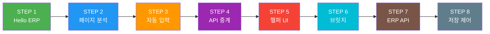

각 단계는 **이전 단계가 동작하는 상태에서** 기능을 추가하는 구조다. 한 단계를 건너뛰면 다음 단계에서 문제가 생긴다.

---

## 준비

### 필수 도구
- **Antigravity IDE** (또는 AI 코딩 도우미가 있는 코드 편집기)
- **Chrome 브라우저**
- 빈 프로젝트 폴더 (예: `~/projects/my-autoreport/`)

### 사전 지식
- Chrome의 F12 (DevTools) 콘솔 탭 열기/닫기
- HTML이 무엇인지 대략적 이해 (당장 코드를 쓸 필요는 없음)

### Chrome 확장이란?

Chrome 확장은 **브라우저에 추가 기능을 덧붙이는 프로그램**이다. 일반 웹사이트와 다른 점:

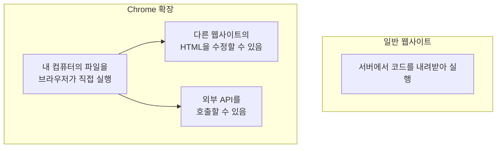

| 구성요소 | 비유 | 역할 |
|----------|------|------|
| `manifest.json` | 이력서 | "나는 어떤 확장이고, 어떤 권한이 필요해" |
| Content Script | 파견 직원 | 다른 웹사이트(ERP)에 들어가서 일함 |
| Background | 주조정실 | 외부 서버와 통신, 전체 조율 |
| Popup | 리모컨 | 사용자가 직접 조작하는 UI |

---

## STEP 1: 프로젝트 생성 — "Hello, ERP"

### 🎯 목표
Chrome 확장이 ERP 페이지에서 실행되는 것을 확인한다.

### 구조도

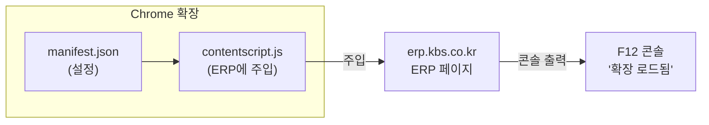

### 💬 AI 프롬프트

```
Chrome Extension Manifest V3 프로젝트를 만들어줘.

요구사항:
1. manifest.json에 content_scripts 설정
2. erp.kbs.co.kr 사이트에서 contentscript.js가 실행되도록 설정
3. contentscript.js는 DOMContentLoaded 이벤트에서 
   console.log('[MyReport] 확장 로드됨') 출력
4. host_permissions에 erp.kbs.co.kr 추가

파일:
- manifest.json
- contentscript.js
```

### 🔍 AI가 만들어주는 코드 미리보기

**manifest.json** — 확장의 이력서:
```json
{
    "manifest_version": 3,
    "name": "MyReport",
    "version": "1.0",
    "description": "ERP 자동화 확장",
    "host_permissions": [
        "*://erp.kbs.co.kr/*"
    ],
    "content_scripts": [{
        "matches": ["*://erp.kbs.co.kr/*"],
        "js": ["contentscript.js"],
        "run_at": "document_start"
    }]
}
```

> 💡 **각 필드 설명:**
> - `manifest_version: 3` — Chrome 최신 규격
> - `matches` — "이 URL에서만 실행해"
> - `run_at: "document_start"` — 페이지가 로드되자마자 실행

**contentscript.js** — ERP에 파견되는 코드:
```javascript
document.addEventListener('DOMContentLoaded', function() {
    console.log('[MyReport] 확장 로드됨');
});
```

### ✅ 확인 방법

```
1. chrome://extensions → 개발자 모드 활성화
2. "압축해제된 확장 프로그램을 로드합니다" → 프로젝트 폴더 선택
3. erp.kbs.co.kr 접속
4. F12 → 콘솔 → "[MyReport] 확장 로드됨" 확인
```

### ⚠️ 안 될 때 체크리스트

| 증상 | 원인 | 해결 |
|------|------|------|
| 확장이 로드 안 됨 | manifest.json 문법 에러 | chrome://extensions에서 에러 메시지 확인 |
| 콘솔에 로그 없음 | URL 패턴 불일치 | `matches`의 URL이 실제 접속 URL과 일치하는지 확인 |
| 이전 버전 로그 출력 | 리로드 안 함 | chrome://extensions에서 🔄 클릭 + 페이지 새로고침 |

### 📝 배운 것
- Chrome 확장의 기본 구조: `manifest.json` + `content_scripts`
- Content Script는 특정 웹사이트에서 자동으로 실행된다

---

## STEP 2: ERP 페이지 분석 — "콘솔로 시스템 파악하기"

### 🎯 목표
ERP 페이지의 HTML 구조와 JavaScript 함수를 파악한다.

### 왜 이 단계가 중요한가?

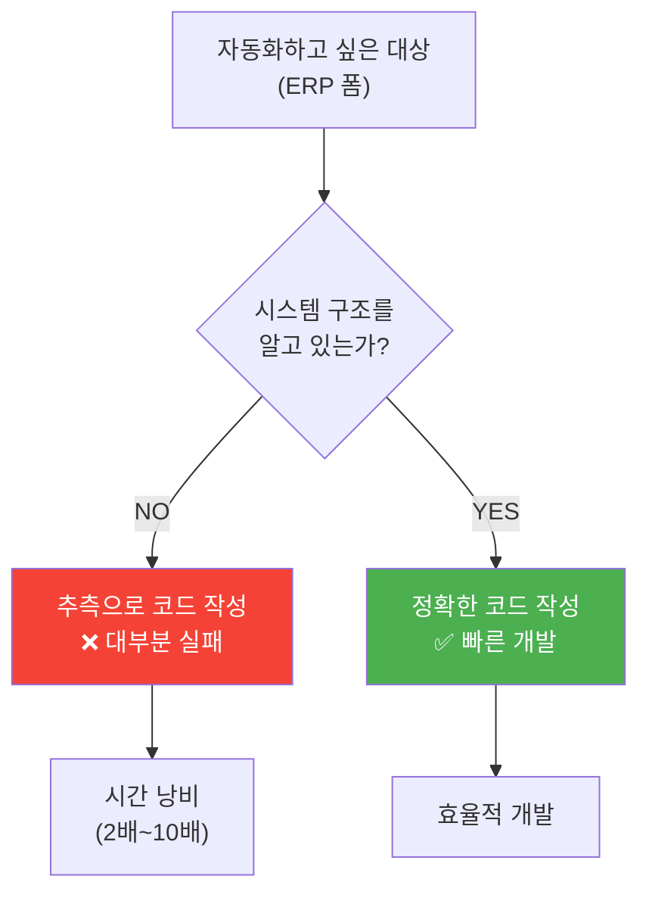

### 💬 AI 프롬프트

```
ERP 실적 등록 페이지가 로드되면, 아래 정보를 콘솔에 출력하는 코드를 만들어줘:

1. 페이지의 모든 input, select, textarea 요소의 id와 name 속성 목록
2. 페이지의 버튼들 (id, onclick 속성 포함)
3. window에 정의된 사용자 함수 목록 (typeof가 function인 window 속성)

각 항목을 console.table()로 보기 좋게 출력해줘.
```

### 🔍 콘솔에서 직접 실행하는 분석 코드

AI가 만들어줄 코드 외에, 콘솔에 직접 붙여넣어 실행할 수도 있다:

**입력 필드 스캔:**
```javascript
// F12 콘솔에 복사-붙여넣기
console.table(
  Array.from(document.querySelectorAll('input, select, textarea'))
    .map(el => ({
      태그: el.tagName,
      ID: el.id,
      Type: el.type,
      현재값: el.value?.substring(0, 30)
    }))
);
```

**버튼 이벤트 스캔:**
```javascript
console.table(
  Array.from(document.querySelectorAll('[onclick]'))
    .map(el => ({
      텍스트: el.textContent?.trim().substring(0, 20),
      onclick: el.getAttribute('onclick')
    }))
);
```

**페이지 함수 스캔:**
```javascript
const builtins = new Set(Object.getOwnPropertyNames(Window.prototype));
Object.getOwnPropertyNames(window)
  .filter(k => typeof window[k] === 'function' && !builtins.has(k))
  .forEach(name => console.log(`  함수: ${name}`));
```

### 핵심 발견 결과

분석을 마치면 아래와 같은 **시스템 지도**가 그려진다:

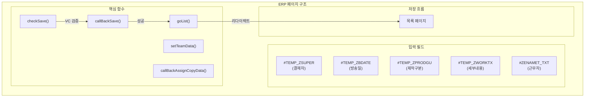

### ✅ 확인 사항
- 콘솔에서 ERP 폼의 **필드 ID** 목록 확인 (예: `#TEMP_ZSUPER`, `#TEMP_ZBDATE`)
- 저장 버튼의 **onclick** 속성 확인 (예: `checkSave()`)
- `setTeamData`, `callBackSave` 같은 **핵심 함수** 발견

### 📝 배운 것
- DevTools 콘솔은 웹 시스템을 분석하는 **가장 강력한 도구**
- 시스템을 수정하지 않고도 내부 구조를 파악할 수 있다
- 이 분석 결과가 이후 자동화의 **설계도**가 된다

> 💡 **상세 문서**: [ERP_REVERSE_ENGINEERING.md](./ERP_REVERSE_ENGINEERING.md)

---

## STEP 3: 기본 정보 자동 입력 — "매일 같은 값은 컴퓨터가 넣자"

### 🎯 목표
결재자 사번과 방송일을 자동으로 채운다.

### 동작 흐름

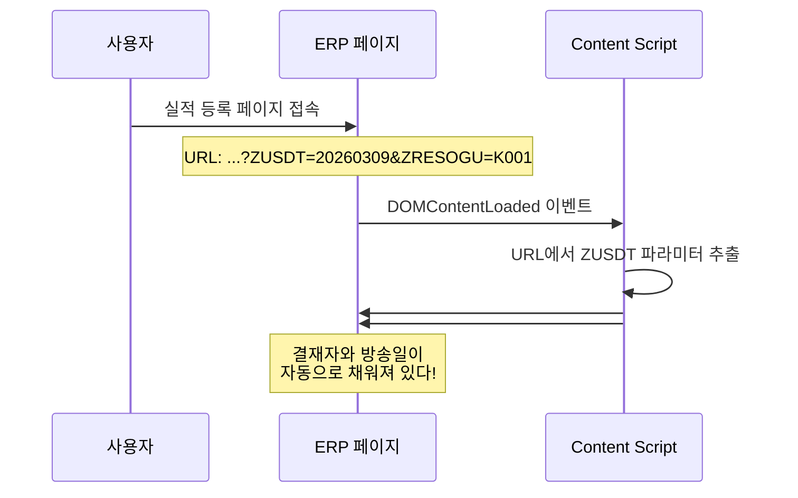

### 💬 AI 프롬프트

```
contentscript.js에 기능을 추가해줘.

ERP 실적 등록 페이지(ins_res_reg_0200.htm)가 로드되면:
1. #TEMP_ZSUPER 입력란에 "30883" 자동 입력
2. URL 쿼리 파라미터에서 ZUSDT 값(YYYYMMDD)을 읽어서 
   YYYY/MM/DD 형식으로 변환 후 #TEMP_ZBDATE에 자동 입력

URL 예시: ...?ZUSDT=20260309&ZRESOGU=K001

주의: 페이지 URL에 따라 분기해야 함
- ins_res_reg_0200.htm → TS 실적 (TV 스튜디오)
- ins_res_reg_0320.htm → NS 실적 (뉴스 스튜디오)
- ins_res_list.htm → 목록 (자동 입력 불필요)
```

### 🔍 핵심 개념: URL 쿼리 파라미터

```
https://erp.kbs.co.kr/.../ins_res_reg_0200.htm?ZUSDT=20260309&ZRESOGU=K001
                                                 └─────┬─────┘ └────┬───┘
                                                    날짜         리소스 구분
```

```javascript
// URL에서 파라미터 추출하는 방법
const url = new URL(window.location.href);
const zusdt = url.searchParams.get('ZUSDT');  // "20260309"

// YYYYMMDD → YYYY/MM/DD 변환
const formatted = `${zusdt.slice(0,4)}/${zusdt.slice(4,6)}/${zusdt.slice(6,8)}`;
// "2026/03/09"
```

### ✅ 확인 사항
- 페이지 로드 후 결재자란에 `30883`이 자동으로 들어가 있다
- 방송일란에 URL의 날짜가 `YYYY/MM/DD` 형식으로 들어가 있다

### 📝 배운 것
- URL 쿼리 파라미터에서 값을 추출하는 방법
- DOM 요소의 `value` 속성을 변경하여 폼을 자동 입력하는 방법
- URL 경로에 따라 코드를 분기하는 패턴

---

## STEP 4: 외부 API 호출 — "TVDSS에서 데이터 가져오기"

### 🎯 목표
Background Service Worker를 통해 외부 시스템의 데이터를 가져온다.

### 왜 Background가 필요한가?

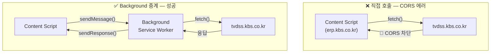

> 💡 **CORS(Cross-Origin Resource Sharing)란?**  
> 보안을 위해 브라우저가 "다른 도메인으로의 요청"을 차단하는 정책이다.  
> `erp.kbs.co.kr`에서 실행되는 Content Script가 `tvdss.kbs.co.kr`에 요청하면 → 차단!  
> Background Service Worker는 이 제한이 없으므로 **중계소** 역할을 한다.

### 💬 AI 프롬프트

```
Background Service Worker(background.js)를 만들어줘.

요구사항:
1. chrome.runtime.onMessage로 메시지 수신
2. "get_schedule" 메시지가 오면 tvdss.kbs.co.kr의 편성확인 API 호출
3. API 결과를 요청자에게 sendResponse로 반환
4. 콘솔에 요청 내용, 응답 결과를 로그 출력

manifest.json에 추가할 것:
- "background": { "service_worker": "background.js", "type": "module" }
- host_permissions에 tvdss.kbs.co.kr 추가

비동기 응답을 위해 addListener에서 return true를 반환해야 한다.
```

### 🔍 비동기 응답의 함정

```javascript
// ❌ 잘못된 코드 — sendResponse가 작동하지 않음
chrome.runtime.onMessage.addListener((req, sender, sendResponse) => {
    fetch('https://tvdss.kbs.co.kr/api/...')
        .then(r => r.json())
        .then(data => sendResponse(data));  // ← 이미 채널이 닫혀있음!
});

// ✅ 올바른 코드 — return true로 채널 유지
chrome.runtime.onMessage.addListener((req, sender, sendResponse) => {
    (async () => {
        const data = await fetch('https://tvdss.kbs.co.kr/api/...');
        sendResponse(await data.json());
    })();
    return true;  // ← "나중에 응답할 거니까 채널 열어둬!"
});
```

### 메시지 흐름

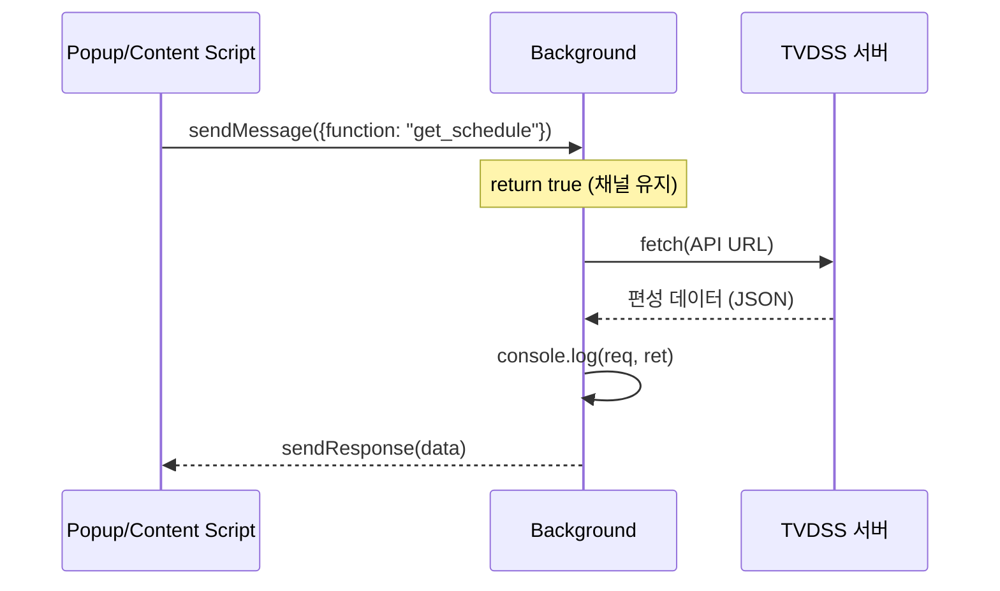

### ✅ 확인 사항
- chrome://extensions → 서비스 워커 링크 클릭 → 콘솔에서 API 응답 확인
- 구분선(`----------`)과 함께 **req**, **ctx**, **ret**이 출력되는지 확인

### 📝 배운 것
- Chrome 확장의 3개 영역: Popup / Background / Content Script
- CORS 우회를 위한 메시지 중계 패턴
- `return true`가 없으면 비동기 응답이 사라진다

---

## STEP 5: 헬퍼 UI 삽입 — "ERP 위에 우리만의 도구를 얹자"

### 🎯 목표
ERP 페이지에 근무자 선택 체크박스를 추가한다.

### 설계 원칙: 기존 시스템을 건드리지 않는다

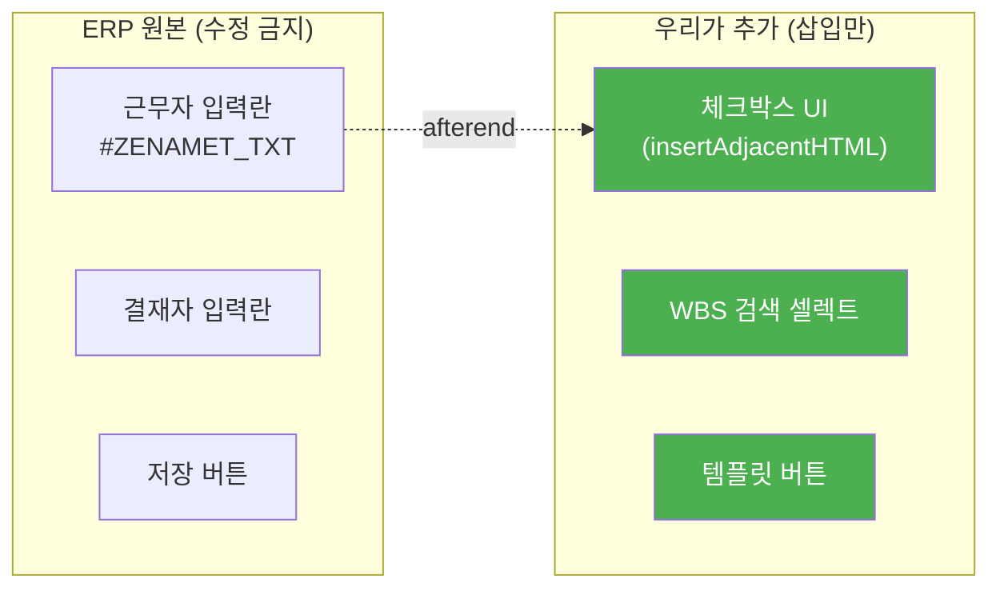

### 💬 AI 프롬프트

```
ERP 페이지의 근무자 입력란(#ZENAMET_TXT) 바로 아래에 
조별 체크박스 UI를 삽입하는 코드를 만들어줘.

구성:
- 3개 조(1조, 2조, 3조) × 4개 직종(감독, 영상, 음향, 파일)
- 조 헤더를 클릭하면 해당 조 전체 선택/해제
- 선택된 사람의 이름을 미리보기 영역에 표시

주의사항:
- insertAdjacentHTML('afterend', ...) 사용 (기존 DOM 이벤트 보호)
- 부모 요소를 while 루프로 탐색하여 <tr> 찾기 (ERP 중첩 테이블 구조)
- focus/blur 이벤트로 UI 열림/닫힘 제어
  - 내부 체크박스 클릭 시에는 닫히면 안 됨 (relatedTarget 체크)

근무자 목록 (가명 샘플):
- 1조: [10001, "홍길동"], [10002, "김철수"], [10003, "이영희"], [10004, "박지성"]
- 2조: [20001, "손흥민"], [20002, "황희찬"], [20003, "이강인"], [20004, "김민재"]
- 3조: [30001, "정우영"], [30002, "백승호"], [30003, "조규성"], [30004, "설영우"]
```

### 🔍 핵심 개념: insertAdjacentHTML vs innerHTML

```javascript
// ❌ innerHTML — 기존 내용을 전부 지우고 새로 씀
element.innerHTML = "새 내용";  // 기존 이벤트 핸들러가 모두 사라짐!

// ✅ insertAdjacentHTML — 기존 내용 옆에 추가만 함
element.insertAdjacentHTML('afterend', '<tr>새 행</tr>');
// 기존 ERP 이벤트가 그대로 유지됨!
```

```
삽입 위치 4가지:
<!-- beforebegin: 요소 바로 앞 -->
<target>
    <!-- afterbegin: 첫 번째 자식으로 -->
    기존 내용
    <!-- beforeend: 마지막 자식으로 -->
</target>
<!-- afterend: 요소 바로 뒤 ← 우리는 이것을 사용 -->
```

### 🔍 ERP 테이블에서 부모 행 찾기

ERP 페이지는 테이블 안에 테이블이 중첩되어 있다. 특정 입력란의 부모 `<tr>`을 찾으려면:

```javascript
// #ZENAMET_TXT에서 시작하여 위로 올라가며 <tr> 찾기
let target = document.querySelector('#ZENAMET_TXT');
while (!(target.tagName === "TR" && target.querySelector(':scope > td.etb_bg')))
    target = target.parentNode;
// → target은 이제 원하는 <tr> 행
// → 이 아래에 체크박스 UI를 삽입
```

### ✅ 확인 사항
- ERP 근무자란 아래에 체크박스가 나타난다
- 체크하면 선택된 이름이 미리보기 영역에 표시된다
- ERP의 기존 버튼과 기능이 정상 동작한다 (깨지지 않음)

### 📝 배운 것
- **기존 시스템을 수정하지 않고** 위에 기능을 덧씌우는 패턴
- `insertAdjacentHTML` vs `innerHTML`의 차이
- 이벤트 기반 UI 설계 (focus/blur와 relatedTarget)

---

## STEP 6: 페이지 함수 호출 — "격리 벽 넘기"

### 🎯 목표
Content Script에서 ERP 페이지의 내부 함수(`setTeamData`)를 호출한다.

### 문제 상황

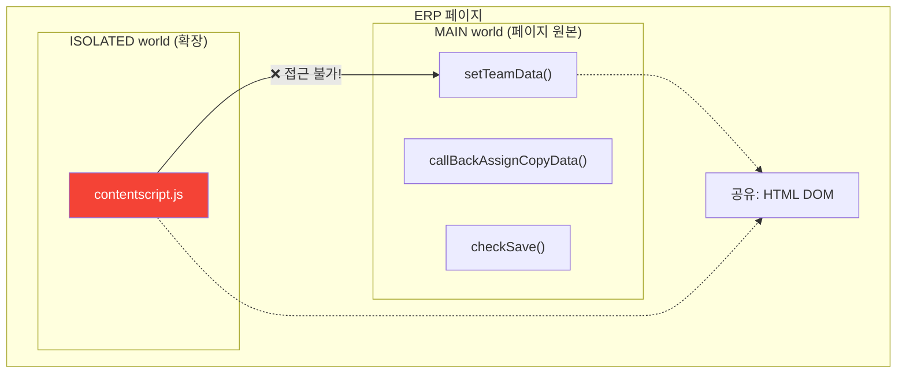

> **비유**: 부조정실(ISOLATED)에서 스튜디오(MAIN) 안의 모니터 화면(DOM)은 볼 수 있지만, 스튜디오 내부 장비의 설정 메뉴(JS 함수)에는 직접 접근할 수 없다.

### 해결 방법 2가지

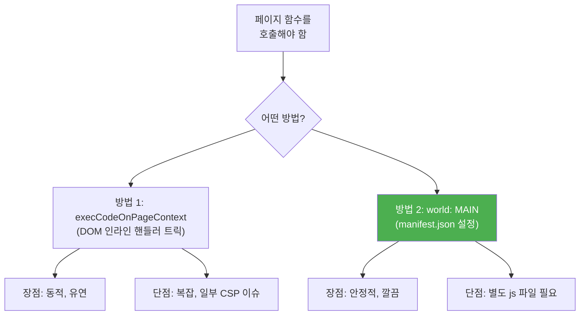

### 💬 AI 프롬프트

```
Content Script에서 ERP 페이지의 setTeamData() 함수를 호출해야 한다.
Chrome 확장의 Content Script가 Isolated World에서 실행되어
페이지 원본 함수에 접근할 수 없는 문제를 해결해줘.

두 가지 방법을 구현:

1. execCodeOnPageContext 함수 (인라인 이벤트 핸들러 브릿지)
   - 임시 DOM 요소를 만들고 onload 핸들러에 코드를 삽입
   - CustomEvent로 데이터를 전달하고 결과를 받음

2. manifest.json의 world: "MAIN" 옵션 사용
   - 별도 js 파일을 페이지 컨텍스트에서 직접 실행
   - run_at: "document_idle"로 모든 스크립트 로드 후 실행

각 방법에 한글 주석으로 동작 원리를 설명해줘.
```

### 🔍 execCodeOnPageContext 동작 원리

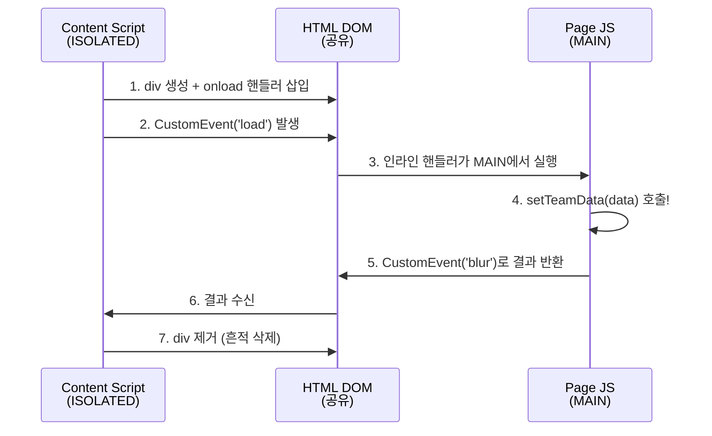

### 📝 배운 것
- Chrome 확장의 **Isolated World** 개념
- MAIN world vs ISOLATED world — 같은 DOM을 보지만 JS는 분리
- 두 세계를 연결하는 두 가지 기법

---

## STEP 7: ERP API 직접 호출 — "저장을 우리가 제어하자"

### 🎯 목표
ERP의 AJAX 엔드포인트를 직접 호출하여 실적을 저장한다.

### ERP API 구조

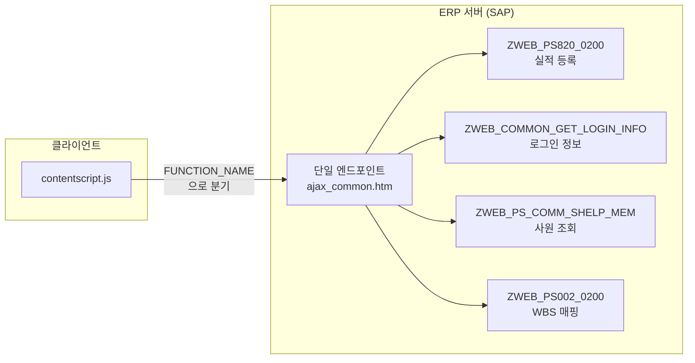

### 💬 AI 프롬프트

```
ERP SAP 백엔드의 AJAX API를 직접 호출하는 함수들을 만들어줘.

공통 패턴:
- 엔드포인트: /kbs(btoa('l=ko&c=300'))/zweb_common/ajax_common.htm
- 메서드: POST
- Content-Type: application/x-www-form-urlencoded
- body: ajax_params=encodeURIComponent(JSON.stringify({...}))
- FUNCTION_NAME 파라미터로 호출할 SAP 함수 지정
- SAP 응답이 비표준 JSON(키에 따옴표 없음)이므로 정규식 교정 필요
- 내부 객체는 JSON.stringify로 이중 직렬화 필요

구현할 함수:
1. __hotfix_malform_json(text) — 비표준 JSON 교정
2. load_login_info() — ZWEB_COMMON_GET_LOGIN_INFO
3. load_member(사번배열) — ZWEB_PS_COMM_SHELP_MEM
4. list_wbs(시작일, 종료일) — ZWEB_PS002_0200
5. save_erp_record(data, loginInfo) — ZWEB_PS820_0200 (VC검증→C1저장)
```

### 🔍 비표준 JSON 교정 — 왜 필요한가?

```javascript
// SAP 서버가 보내는 응답 (비표준):
{ E_RCODE: "S", E_RMSG: "저장 완료" }
// → JSON.parse() 실패! (키에 따옴표가 없으므로)

// 교정 후 (표준):
{ "E_RCODE": "S", "E_RMSG": "저장 완료" }
// → JSON.parse() 성공!

// 교정 함수:
const __hotfix_malform_json = text =>
    text.replace(/\s*(['"])?([a-z0-9A-Z_\.]+)(['"])?\s*:([^,\}]+)(,)?/g,
                  '"$2": $4$5');
```

### 🔍 이중 직렬화 — SAP의 특이한 요구사항

```javascript
// SAP은 내부 객체를 "문자열"로 보내야 한다
body: `ajax_params=${encodeURIComponent(JSON.stringify({
    FUNCTION_NAME: "ZWEB_PS820_0200",
    I_MODE: "C1",
    CS_7523: JSON.stringify(formData),     // ← 객체를 문자열로!
    IT_7505: JSON.stringify(workerList)     // ← 이것도!
}))}`
```

### 📝 배운 것
- SAP ERP API의 독특한 구조 (단일 엔드포인트 + FUNCTION_NAME 분기)
- 레거시 시스템의 비표준 출력을 정규화하는 **방어적 프로그래밍**
- 이중 JSON 직렬화 (레거시 시스템 대응)

---

## STEP 8: 저장 리다이렉트 방지 — "3중 안전장치"

### 🎯 목표
저장 후 목록 페이지로 이동하는 것을 방지한다.

### 문제 상황

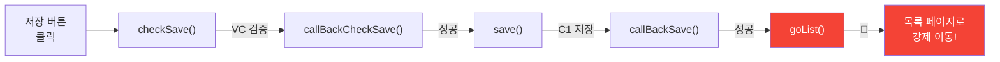

### 해결: 3중 안전장치

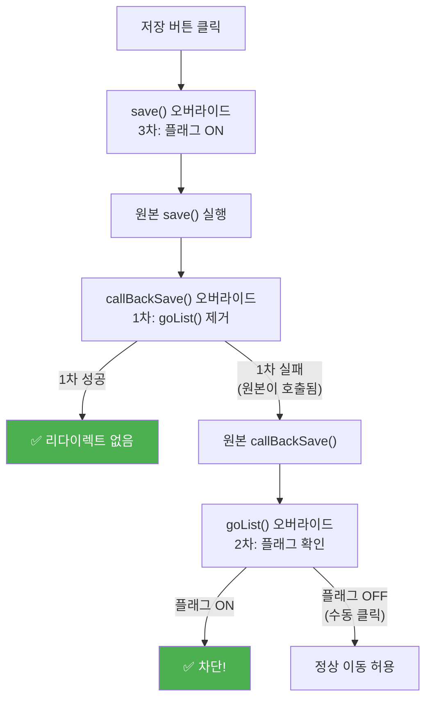

### 💬 AI 프롬프트

```
ERP 저장 흐름:
  checkSave() → callAJAX(VC검증) → callBackCheckSave()
  → save() → callAJAX(C1저장) → callBackSave() → goList() ← 리다이렉트!

이 리다이렉트를 방지하는 override_checksave2.js를 만들어줘.

manifest.json 설정:
- world: "MAIN" (페이지 컨텍스트에서 실행)
- run_at: "document_idle" (모든 스크립트 로드 후)

3중 안전장치:
1. callBackSave 오버라이드 → goList() 호출 대신 콘솔 로그만 출력
2. goList 오버라이드 → 저장 컨텍스트에서만 차단, 수동 "목록" 버튼 클릭은 허용
3. save 함수에 플래그(_autoReportSaveInProgress) 설정

각 안전장치에 console.log를 넣어서 어떤 것이 동작했는지 확인 가능하게.
IIFE로 감싸서 전역 변수 오염을 방지해줘.
```

### 🔍 핵심 개념: 함수 래핑(Wrapping) 패턴

```javascript
// 원본 보관 → 새 함수로 교체 → 필요시 원본 호출
var _original = window.goList;

window.goList = function() {
    if (window._autoReportSaveInProgress) {
        console.log('🚫 차단!');
        return;  // 아무것도 안 함
    }
    _original.call(this);  // 정상 동작 (수동 클릭)
};
```

### 🔍 왜 3중인가?

| 안전장치 | 대상 | 비유 | 필요한 이유 |
|----------|------|------|-------------|
| 1차 | `callBackSave` | 주 차단기 | 직접 goList() 호출을 제거 |
| 2차 | `goList` | 보조 차단기 | SAP이 콜백을 캐싱했을 때 대비 |
| 3차 | `save` | 플래그 스위치 | 2차가 "자동 저장 vs 수동 클릭"을 구분하기 위함 |

> 💡 방송 장비의 **이중/삼중 안전장치**와 같은 원리다. 하나가 뚫려도 다음 단계에서 차단된다.

### ✅ 확인 방법

```
1. ERP 등록 페이지 접속
2. F12 콘솔에서 확인:
   [AutoReport] override_checksave2.js 로드됨 (v3 - document_idle)
   [AutoReport] ✅ callBackSave 오버라이드 완료
   [AutoReport] ✅ goList 오버라이드 완료
   [AutoReport] ✅ save 오버라이드 완료

3. 폼을 채우고 저장 버튼 클릭
4. 콘솔에서 확인:
   [AutoReport] 🔄 저장 시작 — 리다이렉트 차단 플래그 설정
   [AutoReport] ✅ 저장 성공 — goList() 호출 안 함

5. 같은 페이지에 머물러 있으면 ✅ 성공!
```

### 📝 배운 것
- JavaScript 함수 오버라이드 (래핑 패턴)
- `run_at` 타이밍의 중요성 (`document_idle`이 가장 안전)
- 다중 안전장치 설계의 원리
- `world: "MAIN"`으로 페이지 컨텍스트에 직접 코드 주입

---

## 완성 체크리스트

| 단계 | 기능 | 핵심 파일 | 확인 |
|------|------|----------|------|
| 1 | 확장 로드 확인 | `manifest.json`, `contentscript.js` | ☐ |
| 2 | ERP 페이지 분석 | `contentscript.js` (분석 코드) | ☐ |
| 3 | 결재자/방송일 자동 입력 | `contentscript.js` | ☐ |
| 4 | TVDSS API 중계 | `background.js`, `tvdss.js` | ☐ |
| 5 | 근무자 체크박스 UI | `contentscript.js` | ☐ |
| 6 | 페이지 함수 호출 브릿지 | `contentscript.js` | ☐ |
| 7 | ERP API 직접 호출 | `contentscript.js` | ☐ |
| 8 | 저장 리다이렉트 방지 | `override_checksave2.js` | ☐ |

### 최종 아키텍처

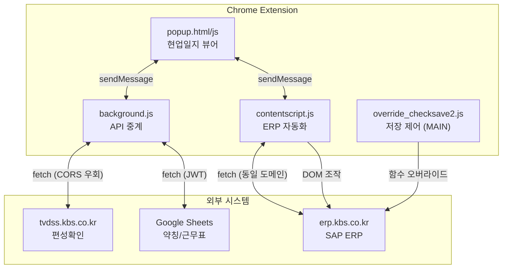

---

## 다음 단계 (심화)

클론 코딩을 완료했다면, 다음 기능을 도전해보자:

| 기능 | 난이도 | AI 프롬프트 키워드 |
|------|--------|-------------------|
| 팝업 UI (현업일지 뷰어) | ⭐⭐ | "popup.html + popup.js, TVDSS 데이터로 테이블 렌더링" |
| Google Sheets 연동 | ⭐⭐⭐ | "서비스 계정 JWT 인증, Web Crypto API RSA 서명" |
| 엑셀 파서 | ⭐⭐⭐ | "SheetJS로 xlsx 파싱, 병합 셀 대응, 드래그앤드롭 업로드" |
| 플로팅 창 | ⭐⭐ | "chrome.windows.create popup, 탭 찾기 URL 패턴 매칭" |
| WBS 검색 헬퍼 | ⭐⭐⭐ | "셀렉트박스 3개 연동, 21일 주기 하이라이트" |

> ⚠️ 각 기능은 반드시 **이전 단계가 동작하는 상태에서** 추가한다. 한 번에 전부 만들려고 하지 마라.
