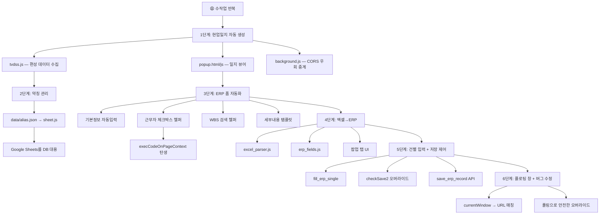

# AutoReport 개발 사고의 흐름

> 이 문서는 홍영기 개발자가 AutoReport를 만들면서 **어떤 순서로 사고하고 문제를 해결해 나갔는지**, 그 흐름을 천천히 따라가며 설명한다.
> "왜 이것이 필요했고, 어떻게 만들게 되었는가"를 중심으로 구성했다.

---

## 시작점: 반복되는 수작업

홍영기 개발자는 KBS 청주방송총국 기술국에서 TV 송출 업무를 담당한다. 매일 해야 하는 작업이 있다:

1. **현업일지 작성** — 오늘 방송한 프로그램, 스팟, 스크롤을 정리해서 문서로 만들기
2. **ERP 실적 등록** — 같은 내용을 ERP 시스템에 한 건씩 입력하기

이 두 작업에서 **데이터는 이미 존재**한다 (TVDSS 편성확인 시스템에 다 있다). 그런데 그 데이터를 사람이 직접 보고 타이핑해야 했다. "왜 컴퓨터가 자동으로 못 해주지?"라는 생각에서 개발이 시작되었다.

---

## 1단계: 현업일지 자동 생성 — "TVDSS 데이터를 가져오자"

### 사고의 흐름

```
"매일 현업일지에 프로그램 목록을 수작업으로 적고 있다."
    → "이 데이터는 TVDSS 편성확인 시스템에 이미 있다."
    → "TVDSS에서 자동으로 가져와서 일지를 만들면 되겠다!"
```

### 이것이 필요하여

TVDSS(tvdss.kbs.co.kr)는 KBS의 편성확인 시스템으로, 당일 방송 스케줄이 모두 등록되어 있다. 여기서 데이터를 가져오면 현업일지를 자동으로 만들 수 있다.

### 이렇게 만들었다

1. **tvdss.js** — TVDSS API를 호출하여 편성 스케줄과 스크롤 송출 결과를 가져오는 모듈
2. **popup.html + popup.js** — 가져온 데이터로 현업일지 형태의 HTML 테이블을 렌더링

### 만나게 된 문제와 해결

**문제:** TVDSS API는 외부 도메인이라 CORS(Cross-Origin Resource Sharing) 제한에 걸렸다.

```
"Content Script에서 직접 fetch()를 호출하니 CORS 에러가 난다."
    → "크롬 확장의 Background Service Worker는 CORS 제한이 없다!"
    → "popup → background → TVDSS API 순으로 중계하자."
```

이렇게 **background.js**가 탄생했다. "메시지 중계소" 역할이다.

**문제:** TVDSS 세션이 만료되면 로그인 페이지로 리다이렉트된다.

```
"API 호출 결과가 갑자기 빈 데이터로 온다."
    → "알고 보니 세션 만료로 로그인 페이지로 리다이렉트되고 있었다."
    → "리다이렉트를 감지하면 자동 재로그인 후 재시도하자!"
```

TVDSS의 모든 API 호출에 **RETRY 로직(최대 10회)**을 내장했다. `fetch({ redirect: 'manual' })`로 리다이렉트를 감지하고, `do_login()`으로 자동 재로그인한다.

---

## 2단계: 프로그램 약칭 관리 — "풀 네임이 너무 길다"

### 사고의 흐름

```
"TVDSS에서 가져온 프로그램명이 '충북의 창 - KBS 충주 제작' 처럼 너무 길다."
    → "현업일지에는 '충북의 창' 정도로 줄여 써야 한다."
    → "프로그램ID → 약칭 매핑 테이블이 필요하다!"
```

### 이것이 필요하여

처음에는 로컬 JSON 파일(`data/alias.json`)에 매핑을 관리했다. 하지만 프로그램이 신설/종영될 때마다 코드를 수정하고 확장을 리로드해야 하는 문제가 있었다.

### 이렇게 만들었다

```
"alias.json을 매번 수정하고 확장을 리로드하는 건 번거롭다."
    → "동적으로 관리할 수 있는 외부 저장소가 필요하다."
    → "별도 서버를 만들기는 과하다... Google Sheets를 DB처럼 쓰면 어떨까?"
```

**sheet.js** 탄생 — Google Sheets API를 JWT 서비스 계정으로 인증하여, Sheets를 약칭/근무표 저장소로 활용.

**만나게 된 문제:** Google API 인증에는 보통 서버사이드 코드가 필요하다.

```
"서버 없이 브라우저만으로 Google API 인증을 해야 한다."
    → "서비스 계정 + JWT 방식이면 서버 없이 가능하다!"
    → "Web Crypto API(crypto.subtle)로 RSA 서명을 직접 구현하자."
```

브라우저의 `crypto.subtle.sign()`으로 JWT를 직접 서명하는 코드를 작성했다. 외부 라이브러리 없이 순수 Web API만으로 구현.

---

## 3단계: ERP 실적 등록 자동화 — "입력 폼이 너무 많다"

### 사고의 흐름

```
"ERP 실적 등록 페이지에 입력할 필드가 20개가 넘는다."
    → "WBS 코드, 근무자 사번, 방송 시간... 매번 수동 입력은 비효율적."
    → "Content Script로 ERP 페이지에 도우미 UI를 삽입하자!"
```

### 이것이 필요하여

ERP(erp.kbs.co.kr)는 SAP 기반 시스템으로, 리소스 실적을 한 건씩 등록해야 한다. 한 번 등록에 필요한 필드:
- WBS 코드 (프로그램 식별자)
- 방송일, 시작/종료 시간
- 제작구분 (생방, 녹화, 더빙 등)
- 근무자 4명의 사번
- 결재자 사번
- 세부내용 (텍스트 블록)

### 이렇게 만들었다 (단계적 확장)

#### 3-1. 기본 정보 자동 입력 (`fill_default_info`)

```
"매번 결재자 사번과 방송일을 입력하는 건 의미 없는 반복이다."
    → "페이지 로드 시 자동으로 채우자."
```

URL 쿼리 파라미터에서 날짜를 추출하여 자동 세팅.

#### 3-2. 근무자 선택 헬퍼 (`add_worker_helper`)

```
"근무자 사번을 매번 외워서 입력해야 한다."
    → "조별 체크박스 UI를 만들어서 클릭만으로 입력하자!"
    → "체크하면 사번을 자동으로 조회하여 ERP 폼에 넣어주면 된다."
```

ERP 원본 페이지에 **조별 체크박스 UI**를 삽입. 체크하면 `load_member()` API로 사원 정보 조회 → `setTeamData()`로 ERP 폼에 전달.

**만나게 된 문제:** Content Script에서 ERP 페이지의 `setTeamData()` 함수를 직접 호출할 수 없었다.

```
"setTeamData()를 호출하면 'setTeamData is not defined' 에러가 난다."
    → "Content Script는 페이지와 격리된 JS 환경(Isolated World)에서 실행된다!"
    → "DOM의 인라인 이벤트 핸들러를 이용한 브릿지(execCodeOnPageContext)를 만들자."
```

**execCodeOnPageContext** 탄생 — DOM 요소에 `onload` 인라인 핸들러를 삽입하여 페이지 컨텍스트에서 코드를 실행하는 트릭.

#### 3-3. WBS 검색 헬퍼 (`add_search_helper`)

```
"WBS 코드를 수동으로 찾아 입력하는 게 번거롭다."
    → "오늘 편성된 프로그램 목록을 WBS와 매핑해서 셀렉트박스로 보여주자."
    → "과거 실적을 복사하는 기능도 있으면 편하겠다."
```

3개의 셀렉트박스를 삽입:
1. **해당 날짜 프로그램** — `list_wbs()`로 당일 편성 조회
2. **선택 프로그램 회차** — `search_wbs()`로 전체 회차 중 현재 주 하이라이트
3. **과거 기록 가져오기** — `history_erp()` + `load_erp()`로 과거 실적 복사

**21일(3주) 주기 하이라이트:** 3개 조가 3주 주기로 순환 근무하므로, 21일 전의 실적이 자기 조의 과거 실적이다. `__calc_day_difference() % 21 == 0` 조건으로 초록색 하이라이트.

#### 3-4. 세부내용 템플릿 (`add_detail_template_helper`)

```
"세부내용란에 입력하는 텍스트가 거의 매번 같다."
    → "생방이면 생방 템플릿, 녹화면 녹화 템플릿을 자동으로 넣자."
```

제작구분 → 템플릿 매핑을 만들고, 버튼 클릭 시 자동 입력.

---

## 4단계: 엑셀 → ERP 파이프라인 — "엑셀도 자동으로 넣고 싶다"

### 사고의 흐름

```
"현업일지를 엑셀로 작성하고, 같은 내용을 ERP에 또 입력한다."
    → "엑셀 파일을 읽어서 ERP에 자동 입력하면 이중 작업이 없어진다!"
    → "팝업에 엑셀 업로드 기능을 추가하자."
```

### 이렇게 만들었다

1. **excel_parser.js** — SheetJS로 .xlsx 파일 파싱, 조근/야근 섹션 자동 추출
2. **popup.html** — 탭 UI 추가 (📋 일지보기 / 📂 엑셀→ERP), 드래그&드롭 업로드
3. **popup.js** — 파싱 결과 미리보기 테이블, 프로그램별 "입력" 버튼
4. **erp_fields.js** — ERP 드롭다운 코드 매핑, 근무자 사번 매핑

### 만나게 된 문제

```
"엑셀 라이브러리(SheetJS)의 sheet_to_json()이 빈 배열을 반환한다!"
    → "병합 셀이 많은 시트에서 고수준 API가 실패하는 것이다."
    → "셀을 직접 하나씩 참조하는 저수준 방식(sheetToArray)으로 해결."
```

---

## 5단계: 컨트롤 강화 — "눈으로 확인하고 싶다"

### 사고의 흐름

```
"일괄 입력은 편하지만, 잘못된 데이터가 그대로 저장될까 불안하다."
    → "한 건씩 폼에 채워서 눈으로 확인한 후 저장 버튼을 직접 누르게 하자."
    → "저장 후 리다이렉트를 방지해야 다음 건을 바로 입력할 수 있다."
```

### 이렇게 만들었다

1. **건별 폼 입력 (`fill_erp_single`)** — popup에서 1건 데이터 전송 → ERP 폼에 채움 → 사용자가 눈으로 확인
2. **저장 리다이렉트 방지** — `checkSave2()` 오버라이드 → CustomEvent → API 직접 저장
3. **프로그램별 입력 버튼** — 미리보기 테이블의 각 행에 개별 "입력" 버튼

---

## 6단계: 플로팅 창 + 트러블슈팅 — "실제 사용하면서 발견한 문제들"

### 사고의 흐름

```
"기본 팝업 창이 너무 작고, 다른 곳을 클릭하면 닫혀버린다."
    → "별도 윈도우(플로팅 창)로 열면 크게 쓸 수 있고 닫히지 않는다."
    → "그런데 플로팅 창으로 바꾸니 ERP 탭을 못 찾는 버그가 생겼다!"
    → "currentWindow가 popup 윈도우를 가리키기 때문. URL 패턴으로 수정."
```

```
"저장 버튼을 누르면 여전히 리다이렉트 된다."
    → "checkSave2 오버라이드가 안 먹히고 있다."
    → "Content Script의 DOMContentLoaded가 ERP 스크립트보다 먼저 실행되어서!"
    → "폴링으로 checkSave2가 정의될 때까지 기다리고 오버라이드."
```

---

## 전체 개발 흐름 요약



---

## 개발 철학: "필요하니까 만든다"

이 프로젝트의 모든 기능은 **실제 업무에서 느낀 불편함**에서 출발했다:

| 불편함 | → 만든 것 |
|--------|----------|
| 매일 같은 일지를 쓴다 | → TVDSS 자동 수집 + 일지 뷰어 |
| 프로그램 이름이 너무 길다 | → Google Sheets 약칭 매핑 |
| ERP 입력 필드가 너무 많다 | → 헬퍼 UI (체크박스, 셀렉트, 템플릿) |
| 엑셀과 ERP에 이중 입력한다 | → 엑셀 파서 + 자동 입력 |
| 저장하면 페이지가 이동한다 | → checkSave2 오버라이드 |
| 팝업이 자꾸 닫힌다 | → 플로팅 창 모드 |

> 💡 **"좋은 도구는 이론에서 나오지 않는다. 실제 사용하면서 불편한 것을 하나씩 고쳐 나가는 것이 진짜 개발이다."**
