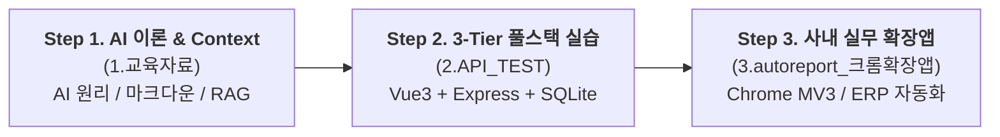

# 🎓 KBS 청주방송총국 AI 바이브 코딩(Vibe Coding) 실무 교육

> **AI 에이전트와 함께하는 차세대 사내 업무 자동화 & 풀스택 소프트웨어 엔지니어링 실습**  
> 본 저장소는 비전공자 방송 기술진과 사내 임직원이 **AI 도구(Antigravity IDE, Claude, Gemini, OpenRouter)**를 활용하여 실무 소프트웨어를 직접 설계하고 구현하는 **3단계 실습형 교육 커리큘럼**의 통합 워크스페이스입니다.

---

## 🎯 교육 목표 및 핵심 철학

1. **"코드를 외우지 않고, 구조를 지휘한다" (Vibe Coding)**
   - 문법 암기식 프로그래밍을 탈피하고, AI에게 명확한 **Context(맥락)**와 **규칙(ADR/Rules)**을 부여하여 고품질 코드를 생성·검증하는 감각을 체득합니다.
2. **이론에서 실무 프로덕션까지 (3-Stage Pipeline)**
   - AI 기본 원리부터 ➔ 3-Tier 풀스택 웹앱 협업 실습 ➔ 실제 사내 ERP 업무 자동화 확장 프로그램 제작까지 단계별로 완주합니다.
3. **5대 엔지니어링 지식 베이스 거버넌스 (`docs/`)**
   - 개발 과정의 모든 의사결정(Why), 아키텍처 다이어그램, 실패 이력(지뢰밭), 트러블슈팅 오답 노트를 체계적으로 기록하는 실무 최고 수준의 문서 관리 기법을 학습합니다.

---

## 🗺️ 전체 3단계 학습 파이프라인 (Curriculum Roadmap)



```text
2026.AutoReport/
├── 📁 1.교육자료/                      # [Step 1] AI 기본 이론 및 프롬프트/컨텍스트 엔지니어링
│   ├── 0-1. 마크다운_문서_읽는_법.md    # 초보자를 위한 마크다운(md) 렌더링 및 읽기 가이드
│   ├── 0-2. 마크다운_문법(참고).md     # 마크다운 기본 문법 및 Mermaid 다이어그램 작성법
│   └── 기본_AI 이해/                   # AI 작동 원리, 개발 환경 세팅, CONTEXT 관리 실습(LAB)
│
├── 📁 2.API_TEST/                     # [Step 2] 3-Tier (Front-Back-DB) 바이브 코딩 실습 샌드박스
│   ├── v1_basic/                      # Node 내장 SQLite 기반 3-Tier 완성 앱 (동작 원리 관찰용)
│   └── v2_extended/                   # AI 에이전트와 함께 한 계층씩 확장하는 단계별 실습 작업대
│
├── 📁 3.autoreport_크롬확장앱/         # [Step 3] KBS CJ TV 업무일지 자동화 Chrome 확장 프로그램
│   ├── docs/                          # 01~07 단계별 클론 코딩 및 ERP 리버스 엔지니어링 교재
│   ├── config.example.js              # 보안 인증 설정 템플릿 (GitHub 공개용)
│   └── *.js / popup.html              # 프론트엔드 DOM 조작 및 백그라운드 Service Worker 소스
│
├── 📁 docs/                           # 🏛️ [프로젝트 거버넌스] 5대 핵심 엔지니어링 지식 베이스
│   ├── CONTEXT.md                     # [아키텍처] 시스템 데이터 흐름 & Mermaid 다이어그램
│   ├── TASKS.md                       # [WBS] 작업 현황 (Doing/Todo/Done/Failed) & 학습 목표
│   ├── CHANGELOG.md                   # [변경 이력] 기술적 변경 내역 및 Big-O/효율 이점
│   ├── HANDOVER.md                    # [인수인계] 현재 세션 상태 요약 & ⚠️실패 이력 (지뢰밭)
│   └── LESSONS.md                     # [오답 노트] 트러블슈팅 [증상➔원인➔해결➔배운점]
│
└── 📄 README.md                       # 본 교육 과정 전체 안내서
```

---

## 📖 세부 교육 과정 안내

### 1️⃣ Step 1. AI 이해 및 컨텍스트 엔지니어링 ([`1.교육자료/`](1.교육자료/))

AI를 단순한 '채팅 봇'이 아닌 **'소프트웨어 개발 파트너'**로 활용하기 위한 필수 기반 지식을 다룹니다.

- **마크다운 표준**: `0-1. 마크다운_문서_읽는_법.md`, `0-2. 마크다운_문법.md` (AI와의 가장 효율적인 대화 형식 체득)
- **개발 환경 구축**: `1-1. 교육준비물.md`, `1-2. 교육과정.md` (Antigravity IDE, WSL, Node.js 환경 세팅)
- **AI 본질 이해**: `2. AI의_이해.md` (LLM의 작동 원리, 확률적 토큰 예측의 본질)
- **Context 실습 (LAB)**: `3-0. CONTEXT_관리.md`, `3-3. CONTEXT_관리_실습(LAB).md` (Context Window 한계 극복, RAG 검색 시뮬레이션, Vercel 웹 배포 실습)
- **사례 연구 & 도구 비교**: `3-1. 영상생성AI의_Context.md`, `3-2. 사례연구_AI_수어통역.md`, `참고1_AI_TOOLS_COMPARISON.md`, `참고2_AI_도입_판별표.md`, `참고3_AGENTS_템플릿.md`

---

### 2️⃣ Step 2. 3-Tier 풀스택 바이브 코딩 실습 ([`2.API_TEST/`](2.API_TEST/))

3인 1조 또는 1인 다역으로 **프론트엔드(Vue 3) - 백엔드(Express) - 데이터베이스(SQLite)**의 3계층 아키텍처를 AI와 협업하여 구축합니다.

- **`v1_basic/` (관찰 및 구조 이해)**:
  - Node.js 내장 `node:sqlite`를 활용한 제로 디펜던시 DB 구축
  - REST API와 WebSocket(Socket.io) 실시간 채팅의 동작 차이 비교
- **`v2_extended/` (단계별 바이브 코딩 확장 실습)**:
  - `DEVELOPMENT_PLAN.md` 지시서를 AI 에이전트에게 전달하여 프론트(404 에러 관찰) ➔ 백엔드(500 에러 관찰) ➔ DB(마이그레이션 및 성공) 순으로 문제를 해결하는 실무 협업 프로세스 훈련

---

### 3️⃣ Step 3. 실전 사내 업무 자동화 확장앱 ([`3.autoreport_크롬확장앱/`](3.autoreport_크롬확장앱/))

실제 KBS 청주총국 TV 기술팀의 레거시 ERP 실적 입력과 TVDSS 편성 확인 시스템을 자동화한 **실제 프로덕션 크롬 확장 프로그램**을 클론 코딩하고 분석합니다.

- **단계별 교재 (`docs/01~07`)**:
  1. `01_TUTORIAL.md`: AI와 함께하는 개발 사고 구조
  2. `02_ERP_REVERSE_ENG.md`: 브라우저 F12 개발자 도구로 사내 ERP 시스템 패킷 분석
  3. `03_CLONE_CODING.md`: 빈 폴더부터 완성까지 8단계 실습
  4. `04_DEVLOG.md`: 6단계 개발 사고 흐름과 기능별 의사결정
  5. `05_CODE_STUDY.md`: JWT RS256 클라이언트 서명, 한셀 ZIP 우회 파싱 등 핵심 기법 10선
  6. `06_REDIRECT_FIX.md`: 크롬 확장의 World 격리(ISOLATED vs MAIN) 제어
  7. `07_TROUBLESHOOTING.md`: 실전 버그 5건 해결 오답 노트
- **보안 격리**:
  - `config.example.js` 템플릿 제공 및 사내 키 주입 가이드를 통해 보안 위험 없는 안전한 실습 지원

---

## 🏛️ 5대 엔지니어링 지식 베이스 (`docs/`)

본 프로젝트는 실리콘밸리 시니어 멘토링 철학을 기반으로, AI와 개발자가 작업할 때마다 아래 5개 문서를 자동으로 최신화합니다:

| 문서 | 역할 및 교육적 목적 |
|---|---|
| **[`docs/CONTEXT.md`](docs/CONTEXT.md)** | **[아키텍처 교과서]** 전체 시스템 데이터 흐름 및 Mermaid 시퀀스/플로우차트 다이어그램 |
| **[`docs/TASKS.md`](docs/TASKS.md)** | **[WBS 작업 관리]** Doing / Todo / Done / Failed(`[!]`) 및 각 항목별 1줄 학습 목표 |
| **[`docs/CHANGELOG.md`](docs/CHANGELOG.md)** | **[기술적 변경 이력]** 무엇을, 왜 수정했는지와 Big-O/렌더링 이점 기록 |
| **[`docs/HANDOVER.md`](docs/HANDOVER.md)** | **[인수인계]** 작업 상태 복구, 핵심 요약(TL;DR), **⚠️실패 이력(지뢰밭)** 보존 |
| **[`docs/LESSONS.md`](docs/LESSONS.md)** | **[오답 노트]** 문제 해결 과정 `[증상 ➔ 원인 ➔ 해결책 ➔ 배운 점]` 기록 |

---

## 🛠️ 교육 권장 환경

- **IDE**: Google Antigravity IDE 또는 VS Code (Agent Mode 활성화)
- **런타임**: Node.js v20+ (LTS)
- **브라우저**: Google Chrome (개발자 모드 활성화)
- **AI API**: OpenRouter, Google Gemini, Anthropic Claude

---
