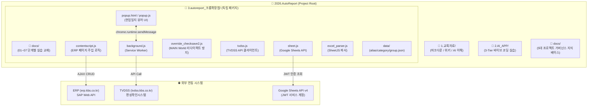

# AutoReport 코드 구조 및 아키텍처 상세 분석

> 최종 갱신: 2026-08-16 (3단계 파이프라인 및 `3.autoreport_크롬확장앱/docs/` 체계화)

---

## 1. 시스템 아키텍처 개요



---

## 2. 파일 및 디렉토리 상세 구조

### 2.1 `3.autoreport_크롬확장앱/` — 크롬 확장 프로그램 (Manifest V3)

- `3.autoreport_크롬확장앱/docs/` — **단계별 교육 교재**
  - `01_TUTORIAL.md` — 입문 가이드 및 환경 세팅
  - `02_ERP_REVERSE_ENG.md` — ERP 개발자 도구 분석
  - `03_CLONE_CODING.md` — 8단계 클론 코딩 실습
  - `04_DEVLOG.md` — 개발자 사고 흐름
  - `05_CODE_STUDY.md` — 핵심 기법 10선
  - `06_REDIRECT_FIX.md` — MAIN world 리다이렉트 방지 가이드
  - `07_TROUBLESHOOTING.md` — 실무 트러블슈팅 오답 노트
- `3.autoreport_크롬확장앱/manifest.json` — 확장 프로그램 설정 (권한, 호스트, 컨텐트 스크립트 등록)
- `3.autoreport_크롬확장앱/background.js` — 백그라운드 Service Worker (TVDSS 통신 및 메시지 릴레이)
- `3.autoreport_크롬확장앱/contentscript.js` — ERP 페이지 DOM 제어 및 데이터 자동 입력
- `3.autoreport_크롬확장앱/override_checksave2.js` — ERP 저장 시 강제 리다이렉트 차단 (MAIN world)
- `3.autoreport_크롬확장앱/popup.html` & `popup.js` — 확장 아이콘 클릭 시 일지 뷰어 렌더링
- `3.autoreport_크롬확장앱/erp_fields.js` — ERP 부서/근무자 사번/코드 상수 매핑
- `3.autoreport_크롬확장앱/excel_parser.js` — 당직/현업일지 엑셀 파서 (SheetJS + 한셀 우회 엔진)
- `3.autoreport_크롬확장앱/sheet.js` — Google Sheets API v4 연동 (서비스 계정 JWT)
- `3.autoreport_크롬확장앱/tvdss.js` — TVDSS 편성 API 클라이언트
- `3.autoreport_크롬확장앱/data/` — 프로그램 약칭(`alias.json`), 분류(`category.json`), 조 구분(`group.json`)

### 2.2 `docs/` — 5대 핵심 엔지니어링 지식 베이스 (거버넌스)
- `docs/CONTEXT.md` — 시스템 아키텍처 및 데이터 흐름 교과서 (현재 문서)
- `docs/TASKS.md` — WBS 작업 관리 (Doing/Todo/Done/Failed) & 학습 목표
- `docs/CHANGELOG.md` — 기술적 변경 이력 및 Big-O/효율 이점
- `docs/HANDOVER.md` — 인수인계 및 ⚠️실패 이력 (지뢰밭)
- `docs/LESSONS.md` — 트러블슈팅 오답 노트

### 2.3 `1.교육자료/` & `2.AI_APP/`
- `1.교육자료/` — 마크다운, 나만의 위키 확장 가이드, AI 기본 이해 및 Context 실습 교재
- `2.AI_APP/` — `v1_basic` (3-Tier 완성형) & `v2_extended` (바이브 코딩 작업대)

---

## 3. 핵심 파일별 상세 동작 원리

### 3.1 `autoreport/manifest.json` — 확장 프로그램 설정

- **Manifest V3** 사용
- **permissions**: `nativeMessaging`, `storage`, `tabs`
- **host_permissions**: ERP, TVDSS, Google OAuth/Sheets 도메인
- **content_scripts**: ERP의 3개 페이지에 `contentscript.js` 주입
  - `ins_res_list.htm` — 리소스 실적 목록 (메인)
  - `ins_res_reg_0200.htm` — TS(TV 서비스) 실적 등록
  - `ins_res_reg_0320.htm` — NS(뉴스 서비스) 실적 등록
- **background.service_worker**: `background.js` (ES Module)

### 3.2 `autoreport/contentscript.js` — 핵심 자동화 (~1750줄)

ERP 페이지 DOM에 직접 개입하여 기능을 확장하는 **메인 로직**.

#### 2.2.1 유틸리티 함수

| 함수 | 설명 |
|------|------|
| `__hotfix_malform_json()` | ERP API가 비표준 JSON(키에 따옴표 없음)을 반환하므로 정규식으로 교정 |
| `execCodeOnPageContext()` | Content Script의 격리된 스코프에서 **페이지 원본 JS 컨텍스트**(예: `setTeamData()`)를 호출하기 위한 트릭 |
| `__calc_week_head()` | 주어진 날짜의 직전 월요일 계산 (주간 편성 기준) |
| `__calc_week_difference()` | 두 날짜의 주 차이 계산 |
| `__calc_month_difference()` | 두 날짜의 월 차이 계산 |
| `__calc_day_difference()` | 두 날짜의 일 차이 계산 |

#### 2.2.2 ERP API 래퍼 함수

모두 `fetch()`로 ERP SAP 백엔드의 AJAX 엔드포인트를 호출합니다.

| 함수 | SAP Function | 용도 |
|------|--------------|------|
| `load_login_info()` | `ZWEB_COMMON_GET_LOGIN_INFO` | 로그인된 사용자 정보(사번, 부서코드) 조회 |
| `list_erp()` | `ZWEB_PS820_LIST` | 기간별 리소스 실적 목록 조회 |
| `list_produce_type()` | `ZWEB_PS820_ZPROGU` | 리소스 구분별 제작구분 목록 |
| `history_erp()` | `ZWEB_PS820_2000` | 기간별 이전 실적 내역 조회 (복사용) |
| `load_erp()` | `ZWEB_PS820_0200` | 특정 실적(ZWSEQ) 상세 로드 (복사 실행용) |
| `load_erp_wbs()` | `ZWEB_PS_COMM_WBS` | WBS 코드 자동완성 |
| `load_member()` | `ZWEB_PS_COMM_SHELP_MEM` | 사번으로 근무자 정보 일괄 조회 |
| `list_wbs()` | `ZWEB_PS002_0200` | 기간 중 편성에 대한 WBS 매핑 정보 (본방+재방) |
| `search_wbs()` | `ZWEB_PS_CJ20N` | WBS 프로그램의 전체 회차 검색 |
| `load_wbs()` | `ZWEB_PS000_0100` | 특정 WBS 회차의 상세 정보 |
| `save_erp_record()` | `ZWEB_PS820_0200` | ERP 실적 직접 저장 (VC→C1, 리다이렉트 없음) |
| `save_erp_record_vc_only()` | `ZWEB_PS820_0200` | ERP 실적 검증만 수행 (중복 체크용) |

#### 2.2.3 세부내용 템플릿 (`템플릿_세부내용`)

업무 유형별 제작 세부내역 기본 서식을 상수로 정의:
- 뉴스생방, 송출, 더빙, 교양, 공개, 뉴스, 날씨녹화, **참여**

`resolve_detail_template(category, pgmName, zresogu)` 함수가 제작구분과 프로그램명을 조합하여 적절한 템플릿 키를 결정:
- 생방+"충북" → 교양 템플릿 (교양홀 장비 기준)
- 녹화+"날씨" → 날씨녹화, 녹화+"뉴스" → 뉴스, 녹화+기타 → 교양
- 참여(6시내고향 등) → 참여 전용 템플릿

#### 2.2.4 DOMContentLoaded 메인 로직

페이지 URL에 따라 분기:

| 페이지 | 동작 |
|--------|------|
| `ins_res_list.htm` | WBS 목록을 콘솔에 출력 (디버그) |
| `ins_res_reg_0200.htm` | TS 실적 등록 — 기본정보 자동입력 + 근무자 헬퍼 + 검색 헬퍼 + **세부내용 템플릿** |
| `ins_res_reg_0320.htm` | NS 실적 등록 — 위와 동일 (리소스 코드, 코스트센터만 다름) |

**`fill_default_info()`**: 결재자 사번(`30883`)과 방송일을 자동 세팅

**`add_worker_helper()`**: 
- ERP 근무자 입력란 아래에 조별 체크박스 UI 삽입
- 3개 조(1·2·3조) × 4개 직종(감독·영상·음향·파일)으로 구성
- 체크 후 focus out 시 `load_member()` API로 사원 정보 조회 → `setTeamData()` 호출

**`add_search_helper()`**:
- WBS 코드 입력란 아래에 3개 셀렉트박스 삽입:
  1. **해당 날짜 프로그램**: `list_wbs()` → 코스트센터로 필터링
  2. **선택 프로그램 회차**: `search_wbs()` → 주간/월간 코드 매칭으로 현재 주 하이라이트
  3. **과거 기록 가져오기**: `history_erp()` → 동일 WBS의 과거 실적 나열, 선택 시 `load_erp()` + `callBackAssignCopyData()` 호출

**`add_detail_template_helper()` (기능 4 — 세부내용 템플릿)**:
- 세부내용(`#TEMP_ZBSTEXT`) textarea 옆에 "세부내용 템플릿" 버튼 삽입
- 클릭 시 제작구분(`#TEMP_ZPRODGU`) 선택값 → `제작구분_템플릿_매핑` → `템플릿_세부내용[키]` 순으로 매칭
- NS(K003) 페이지의 "생방"은 자동으로 "뉴스생방" 템플릿 적용
- 녹화 선택 시 `guess_녹화_템플릿()`으로 프로그램명 기반 홀 종류 추정 (뉴스/공개/교양)
- 매핑 없는 제작구분은 `prompt()`로 수동 선택

**저장 리다이렉트 방지 (기능 5)**:
- `override_checksave2.js`가 `world: "MAIN"`으로 페이지 컨텍스트에서 직접 실행
- `checkSave2()` 오버라이드 + `Object.defineProperty`로 잠금 (ERP 스크립트 재정의 방지)
- MAIN world에서 직접 폼 데이터 수집 (`TEMP_` 필드 + `oInTeamData`) → VC 검증 → C1 저장
- Cross-world CustomEvent 통신 불필요 (모든 저장 로직이 MAIN world에서 완결)

**메시지 핸들러 (`chrome.runtime.onMessage`)**:
- `fill_erp_single`: 건별 폼 입력 — `callBackAssignCopyData()`로 폼 필드 채움 + 데이터 보관
- `check_erp_duplicates`: VC 검증만 수행하여 중복 체크
- `batch_erp_input`: 일괄 저장 (VC→C1 순차 처리, 중복 건너뛰기)

### 2.3 `popup.html` + `popup.js` — 현업일지 뷰어

#### UI 구성 (`popup.html`)
- 제목 블록: "현업일지(TV)" + 날짜 + 이전/다음/새로고침 버튼
- 결재 블록: 담당/감독/부장 결재란
- 조근 리포트: 근무자 + 스케줄 + 특기사항
- 야근 리포트: 동일 구조
- 일근 리포트: 동일 구조 + 명일 현업 예정사항

#### 로직 (`popup.js`)

1. **`load_tvdss()`**: TVDSS에서 당일 편성 스케줄 가져오기
   - 프로그램(P): 약칭, 방송 시간, 생방/송출 구분
   - 스팟(S): 약칭별 그룹핑, 횟수 집계
   - 스크롤: 5분 간격으로 그룹핑
2. **`make_default_UI()`**: 오전/오후/일근 테이블 초기화
3. **`build_report()`**: 날짜별 리포트 렌더링
   - `group.json`의 시간대(조근 06-14, 야근 14-22)로 스케줄 분배
   - 스팟·스크롤 건수를 특기사항 영역에 출력

### 2.4 `background.js` — Service Worker

- `chrome.runtime.onMessage`로 popup/contentscript의 메시지 수신
- `get_schedule`, `get_scroll` 명령을 `tvdss.js`로 중계
- Manifest V3의 CORS 제한 우회를 위해 Background에서 외부 API 호출
- `chrome.action.onClicked` → 플로팅 창(`chrome.windows.create`)으로 popup.html 열기
- 이미 열린 팝업 창이 있으면 포커스 전환

### 2.5 `tvdss.js` — 편성확인 시스템 API

| 함수 | 엔드포인트 | 용도 |
|------|-----------|------|
| `do_login()` | `/uat/uia/actionLogin.do` | 자동 로그인 (세션 만료 시) |
| `get_schedule()` | `/ajax/day/sclcnfm/list.do` | 일별 편성확인 스케줄 |
| `get_scroll()` | `/ajax/mtr/scroll/result.do` | 스크롤 송출 결과 |
| `get_alias()` | `./data/alias.json` | 로컬 약칭 매핑 |
| `get_category()` | `./data/category.json` | 로컬 분류 매핑 |
| `get_group()` | `./data/group.json` | 로컬 근무시간대 매핑 |

- 모든 API 호출에 **RETRY 로직**(최대 10회) 내장
- 리다이렉트 감지 시 자동 재로그인

### 2.6 `sheet.js` — Google Sheets API

- **JWT(RS256) 서비스 계정 인증** — Web Crypto API로 서명
- Google Sheet ID: `1GabPOfpV7aeqCilMmfdBnsDqPwvBg1SuDMdcUGF-S7E`

| 함수 | 용도 |
|------|------|
| `sign_JWT()` | RSA-SHA256로 JWT 토큰 서명 |
| `build_gapi_token()` | Google API 접근용 Bearer 토큰 생성 |
| `get_sheet_value()` | 시트 값 읽기 |
| `update_sheet_value()` | 시트 값 수정 |
| `append_sheet_value()` | 시트 행 추가 |
| `clear_sheet_value()` | 시트 범위 클리어 |
| `delete_sheet_row()` | 시트 행 삭제 |
| `get_alias()` | 'Alias' 시트에서 프로그램 약칭 조회 |
| `get_member()` | 월별 시트에서 근무자 조회 |
| `get_schedule()` | 월별 시트에서 스케줄 조회 |

### 2.7 `override_checksave2.js` — 저장 리다이렉트 방지 (MAIN world)

- `world: "MAIN"` + `run_at: "document_idle"`로 페이지 컨텍스트에서 직접 실행
- `checkSave2()` 함수를 오버라이드하여 MAIN world 내에서 폼 데이터 수집 + VC 검증 + C1 저장을 직접 수행
- `Object.defineProperty`로 잠금하여 ERP 스크립트의 후속 재정의를 방지
- 비표준 JSON 교정(`fixJson`) 내장

### 2.8 `save_no_redirect.js` — 참고용 스크래치 (더 이상 사용 안 함)

ERP 저장 후 리다이렉트 방지를 위한 **초기 실험 코드 모음**. `override_checksave2.js`으로 대체 완료.

### 2.8 `data/` — 정적 매핑 데이터

| 파일 | 형식 | 내용 |
|------|------|------|
| `alias.json` | `{ID: 약칭}` | 프로그램/스팟 ID → 일지 표시용 약칭 (87건) |
| `category.json` | `{ID: 분류}` | 프로그램 ID → 분류(생방/송출/참여) |
| `group.json` | `{근무: 시간}` | 조근(06-14), 야근(14-22) 시간 범위 |

---

## 3. 데이터 흐름

### 3.1 ERP 실적 입력 플로우 (Content Script)

```
사용자가 ERP 실적 등록 페이지 진입
    │
    ├── fill_default_info(): 결재자 사번 + 방송일 자동 입력
    │
    ├── add_worker_helper(): 근무자 체크박스 UI 삽입
    │   └── [근무자 선택] → load_member() API → setTeamData()
    │
    ├── add_search_helper(): WBS 검색 UI 삽입
    │   ├── [셀렉트1: 해당 날짜 프로그램]
    │   │   └── list_wbs() → 코스트센터 필터 → WBS 자동입력
    │   ├── [셀렉트2: 회차 선택]
    │   │   └── search_wbs() → 주간 매칭 하이라이트
    │   └── [셀렉트3: 과거 기록 복사]
    │       └── history_erp() → load_erp() → callBackAssignCopyData()
    │
    └── add_detail_template_helper(): 세부내용 템플릿 버튼 삽입
        └── [버튼 클릭] → 제작구분 읽기 → 매핑 → 템플릿_세부내용[키] → textarea 채움
```

### 3.2 현업일지 뷰어 플로우 (Popup)

```
확장 아이콘 클릭 → popup.html 로드
    │
    ├── load_tvdss(채널, 지역, 날짜)
    │   ├── get_schedule()    → 프로그램 목록
    │   ├── get_schedule()    → 스팟 목록  
    │   ├── get_scroll()      → 스크롤 목록
    │   └── get_sheet_alias() → 약칭 매핑
    │
    ├── get_group() → 조근/야근 시간대 구분
    │
    └── build_report()
        ├── make_default_UI() × 3 (조근/야근/일근)
        └── 시간대별 프로그램 배치 + 스팟/스크롤 집계
```

---

## 4. 주요 설계 패턴 및 특이사항

1. **Content Script ↔ Page Context 브릿지**: `execCodeOnPageContext()`는 DOM에 인라인 이벤트 핸들러를 삽입하여 페이지 원본 JS 함수(`setTeamData`, `callBackAssignCopyData` 등)를 호출하는 비표준 기법
2. **SAP ERP 비표준 JSON 대응**: `__hotfix_malform_json()`으로 키에 따옴표가 없는 응답을 교정
3. **URL 인코딩된 세션 ID**: ERP URL 경로에 `kbs(bD1rbyZjPTMwMA==)` 패턴이 포함됨 — base64 디코딩 시 `l=ko&c=300` (언어·클라이언트 정보)
4. **3주 근무 주기**: `add_search_helper()`에서 `__calc_day_difference() % 21 == 0` 조건으로 21일(3주) 주기 근무 패턴을 하이라이트
5. **Google Sheets를 DB 대용**: 별도 서버 없이 Google Sheets를 약칭·근무표 저장소로 활용
6. **한셀 xlsx 호환 — ZIP 직접 파싱 + NS 대응 (2026-04-07 추가)**: 한셀(한글과컴퓨터)로 저장된 .xlsx 파일은 SheetJS가 읽지 못하므로, `excel_parser.js`에서 ZIP 중앙 디렉터리를 직접 파싱 → `DecompressionStream('deflate-raw')`로 워크시트 XML 추출 → `(?:\w+:)?` 네임스페이스 접두사 대응 정규식으로 셀 데이터 파싱. 한셀은 모든 XML 태그에 `x:` 접두사를 사용하며(`<x:row>`, `<x:c>`, `<x:v>`), 이는 SheetJS의 content-type 필터링과 일반 정규식 모두 우회해야 하는 이유.
